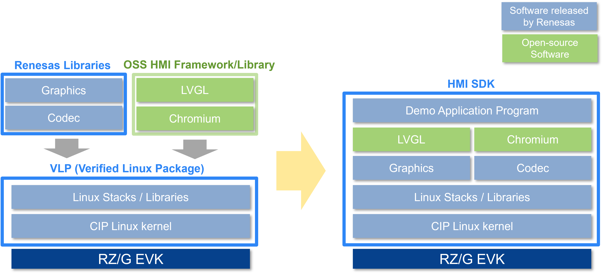

# FAQ

If you have any questions about the HMI SDK, please do not hesitate to raise an issue at our Repository [Issues](https://github.com/renesas-rz/rzg_hmi_sdk/issues){: target="_blank" }.

If your questions are common in RZ/G and/or RZ MPU Linux, you may have answers on the following websites.

* Renesas よくあるご質問 (FAQ) | Knowledge Base (FAQ's) | 知识库 website
	- [[JP] RZ/G](https://ja-support.renesas.com/knowledgeBase/category/31247/subcategory/31249){: target="_blank" }
	- [[EN] RZ/G](https://en-support.renesas.com/knowledgeBase/category/31243/subcategory/31245){: target="_blank" }
	- [[CN] RZ/G](https://zh-support.renesas.com/knowledgeBase/category/31420/subcategory/31421){: target="_blank" }

* Renesas Engineering Community website
	- [[JP] RZ MPU](https://community.renesas.com/cafe_rene/forums-groups/mcu-mpu/rz/f/103__-_forum){: target="_blank" }
	- [[EN] Microprocessors (RZ)](https://community.renesas.com/rz/f/rz-forum){: target="_blank" }
	- [[CN] RZ MPU](https://community.renesas.com/zh/forums-groups/mcu-mpu/rz-mpu/f){: target="_blank" }

* Renesas Wiki's: [RZ/G](https://jira-gasg.renesas.eu/confluence/pages/viewpage.action?pageId=184060061){: target="_blank" }

---

### Q. What is the difference between VLP and HMI SDK?

Please see the figure below.

The left diagram in the figure shows the development method without the HMI SDK. Users need to download and integrate necessary software packages such as VLP (Verified Linux Package), graphics library, codec library, and HMI framework or libraries.
The right diagram in the figure shows the development method with the HMI SDK. The HMI SDK is provided as an 'all-in-one package'. Users do **NOT** need to look for appropriate software and worry about how to integrate all modules.

For information about VLP, please visit the website [RZ/G Software Package](https://www.renesas.com/en/products/microcontrollers-microprocessors/rz-mpus/rzg-series/verified-linux-package).

