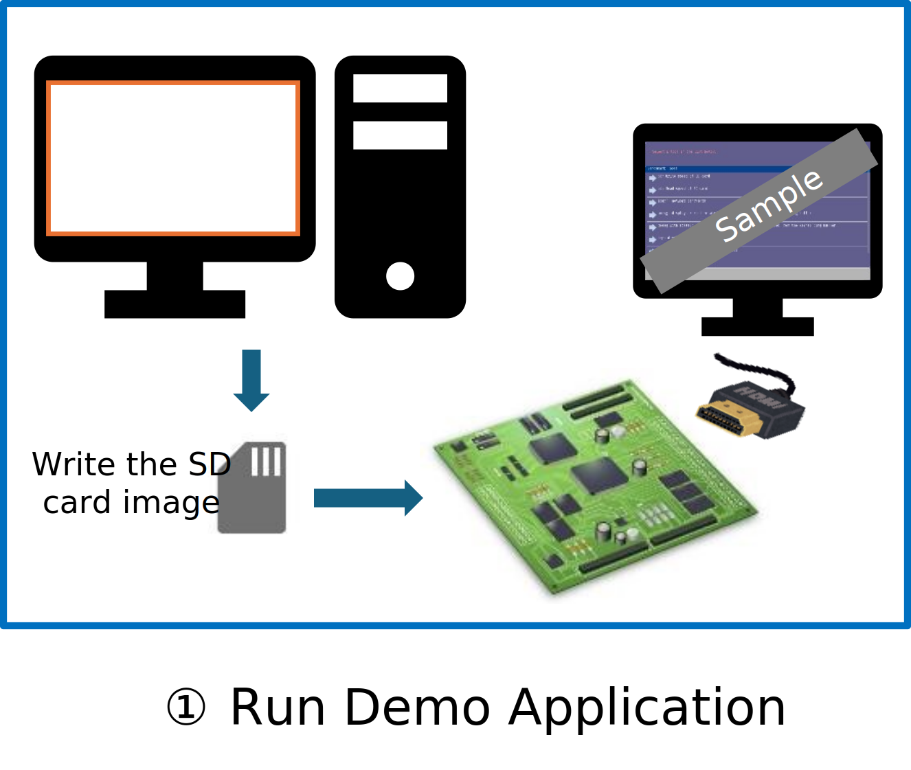
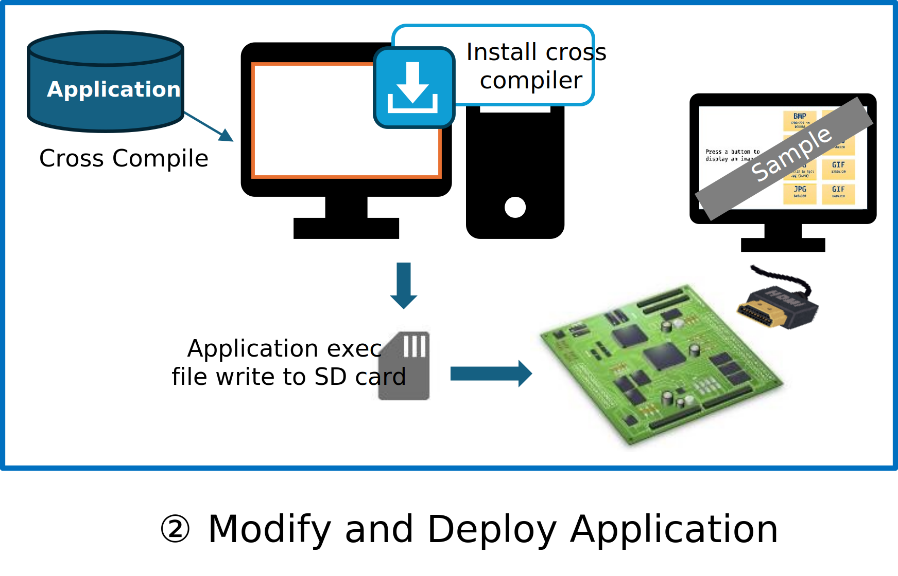
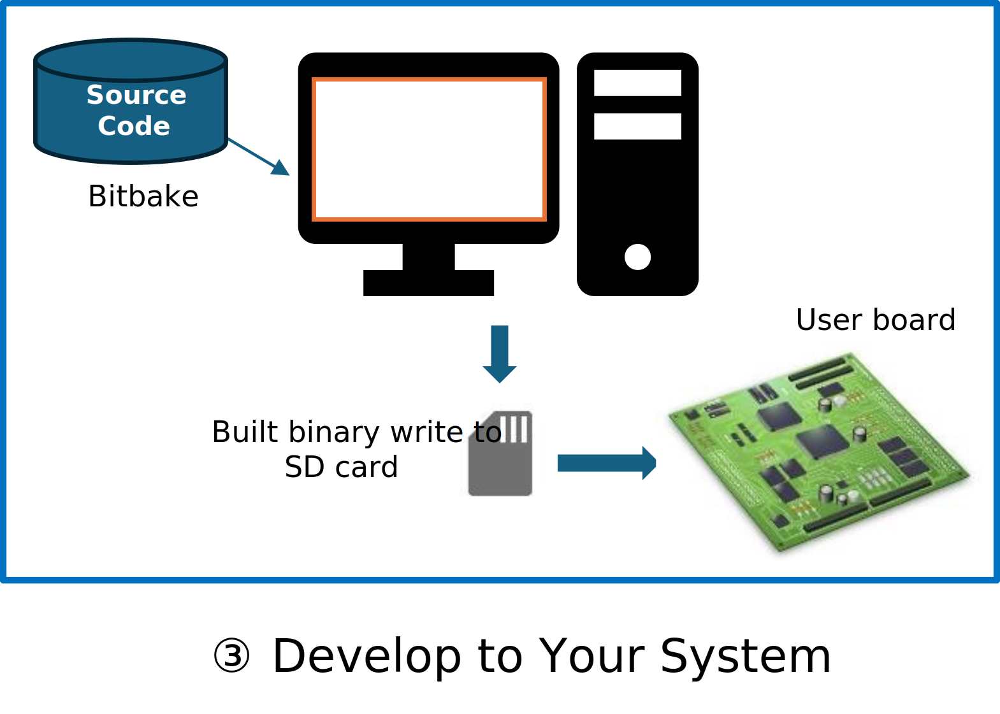

# HMI SDK on RZ/G series

The Renesas RZ/G HMI SDK is an all-in-one package that includes the necessary software for developing a Linux HMI application.
{: .subtitle .center }

The HMI SDK provides a Linux HMI application development environment for the RZ/G Evaluation Board Kit.
{: .sub-subtitle .center }

* Easy-to-Use

    The HMI SDK provides a quick and easy development environment, making it easier for Linux beginners to start using a Linux MPU.

* Free of Charge

    All software in the HMI SDK is available for free.

* Ready-to-Use

    The HMI SDK includes the following GUI frameworks and libraries that are appropriate for HMI.

    * [**LVGL** (Light and Versatile Graphics Library)](https://lvgl.io/), which is a lightweight, free, open-source embedded graphics library.
    * **Chromium**, which is a free and browser-based framework for application programs with GPU.

{ width=27.2% .zoom #banner-left }
{ width=35.75% .zoom }
{ width=32.2% .zoom #banner-right }
{: .center }

By using the image files from the SDK, you can easily create a bootable SD card.
Insert the SD card into the board, and the HMI demo will automatically start on Linux.
You can then begin developing your own application with ease, as the SDK includes an installer for a cross-development toolchain.
Additionally, sample applications that run on the HMI SDK Linux environment are available on our GitHub.

For more information, see [Overview](overview/index.md).








