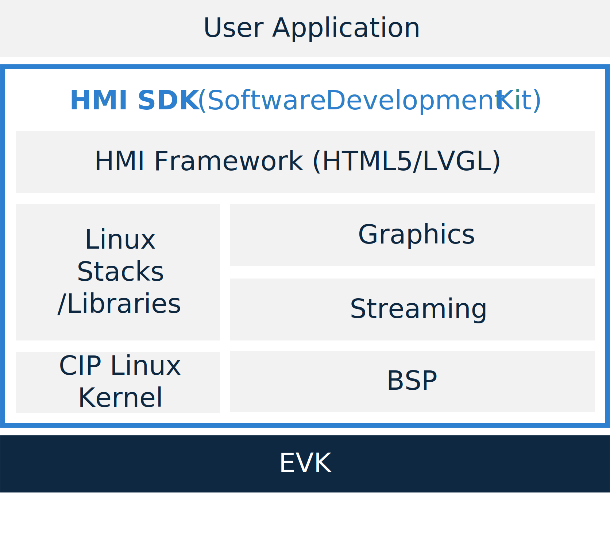

# Overview

{ align=right width=320 }

RZ/G HMI Software Development Kit (HMI SDK) is an HMI application development
environment for Evaluation Board Kit of RZ/G series.

Since it contains [Yocto](https://www.yoctoproject.org/){: target="_blank" } Linux with bootloader,
Linux Kernel, Cross Compiler, multimedia and graphics package, users can
develop HMI Applications easily and quickly with HMI SDK.

HMI SDK is specifically made for the supported Evaluation Board Kit with fixed Linux components.
If you need to customize the Linux environment—such as modifying the memory map or developing support for your own board—you will need to build Yocto Linux from source.

For detailed instructions, please refer to How to build HMI SDK.

[How To Build HMI SDK](../how_to_build_hmi_sdk/index.md){ .md-button .md-button--primary .btn-grey .btn-indent }

{! overview/_components/supported_boards.md !}

{! overview/_components/sdk_components.md !}

{! overview/_components/specification.md !}
