# How to Develop Chromium HMI Applications Using Plasmic

!!! abstract "Page Information"
    The information provided on this page has been verified using the following SDK versions and evaluation kits (EVKs):

    - ***HMI SDK v3.4.0.0 (Yocto 5.0.9 (scarthgap), kernel 6.1) using RZ/G3E EVK***
    - ***HMI SDK v3.4.1.0 (Yocto 5.0.9 (scarthgap), kernel 6.1) using RZ/G2L and RZ/G2LC EVK***

    Last updated: ***April 13, 2026***

[Plasmic](https://www.plasmic.app/) is an open-source visual editing and content platform for building websites and apps. Integrate with existing codebases. Ship incredibly fast. For more information about Plasmic, see the [Plasmic GitHub Repository](https://github.com/plasmicapp/plasmic).  

This guide describes how to use Plasmic, a web-based visual UI builder, to develop Chromium HMI applications. You will complete the following steps:  

[Step 1: Design UI in Plasmic](../chromium_develop-hmi-using-plasmic/#step-1-design-ui-in-plasmic)  
[Step 2: Create React App and Connect Plasmic](../chromium_develop-hmi-using-plasmic/#step-2-create-react-app-and-connect-plasmic)  
[Step 3: Run the Plasmic Sample Application and Verify Locally](../chromium_develop-hmi-using-plasmic/#step-3-run-the-plasmic-sample-application-and-verify-locally)   
[Step 4: Build the Chromium Sample Application](../chromium_develop-hmi-using-plasmic/#step-4-build-the-chromium-sample-application)  
[Step 5: Deploy the Chromium Sample Application](../chromium_develop-hmi-using-plasmic/#step-5-deploy-the-chromium-sample-application)  
[Step 6: Run the Chromium Sample Application](../chromium_develop-hmi-using-plasmic/#step-6-run-the-chromium-sample-application)  

!!! success "Tip"
    [Step 1](../chromium_develop-hmi-using-plasmic/#step-1-design-ui-in-plasmic) demonstrates how to use Plasmic’s drag-and-drop features to design the UI of your application.  
    [Step 2-3](../chromium_develop-hmi-using-plasmic/#step-2-create-react-app-and-connect-plasmic) explains how to set up and launch the Plasmic project locally.  
    [Step 4](../chromium_develop-hmi-using-plasmic/#step-4-build-the-chromium-sample-application) explains how to build the Plasmic application.  

    If you prefer, you can download the ready-to-use built web application files by [**clicking here**](../packages/plasmic/build.zip) and proceed directly to [Step 5](../chromium_develop-hmi-using-plasmic/#step-5-deploy-the-chromium-sample-application).  


## Step 1: Design UI in Plasmic

### 1-1. Log in and create a new project

Open [Plasmic](https://www.plasmic.app/) and click *Get started free* or *Sign Up* to create an account, then follow the on-screen instructions.  
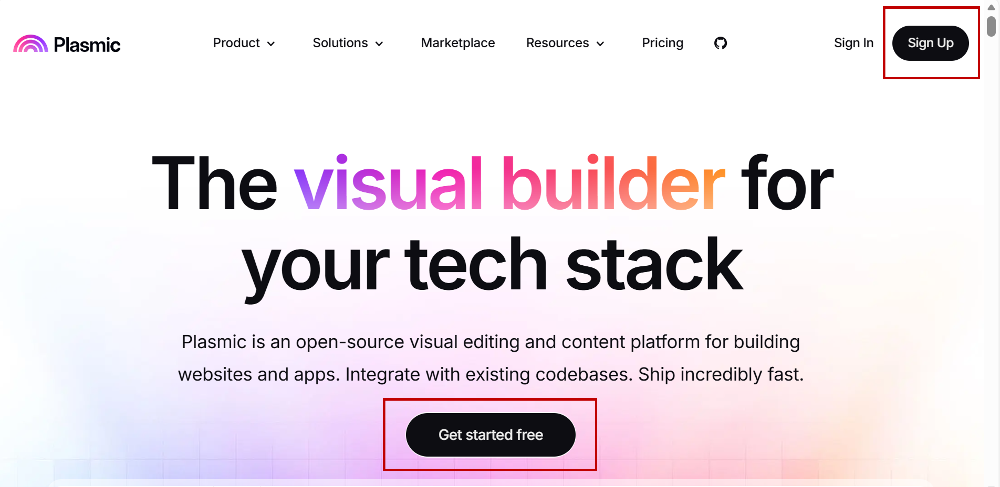{: width="60%"}  

After logging in, create a *New organization*, then create a *New project*.  
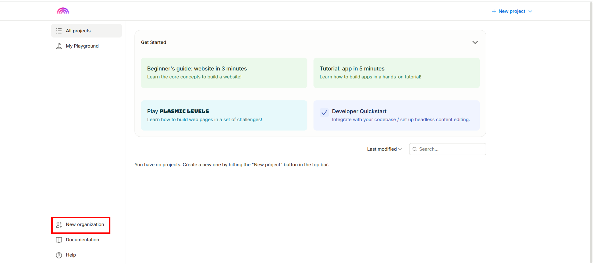{: width="60%"}  
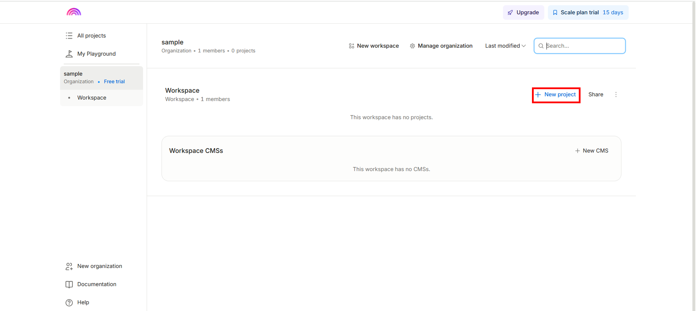{: width="60%"}   

Select the template to use. This guide uses the *App starter* template.  
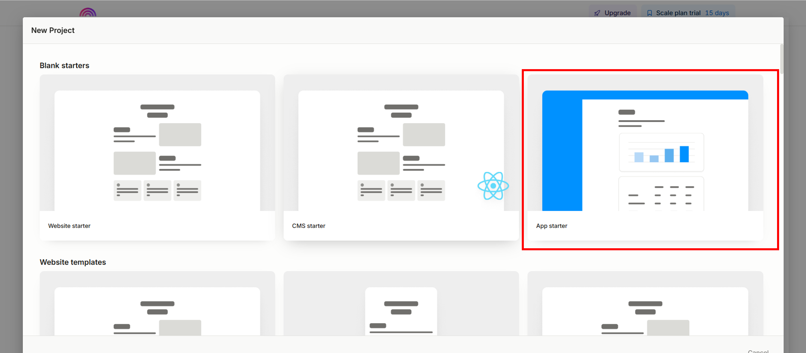{: width="60%"}  

Rename your project to *Plasmic_sample_app*.  
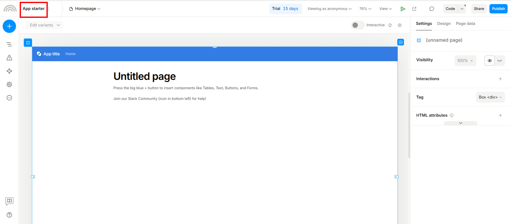{: width="60%"}    


### 1-2. Create pages

In this sample application, 3 pages will be created:  

- [Homepage](#homepage)  
- [JPG page](#jpg-page)  
- [GIF page](#gif-page)  

<br>

1. Design your layout and add or delete components as needed.  

    You can view and delete objects by clicking the *Outline* panel (highlighted in the red frame).  
    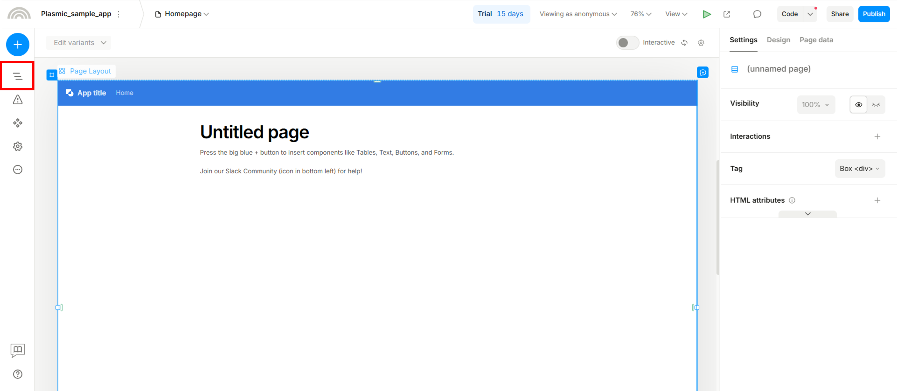{: width="60%"}  

    You can also add components, icons, or images by clicking the *blue button*.      
    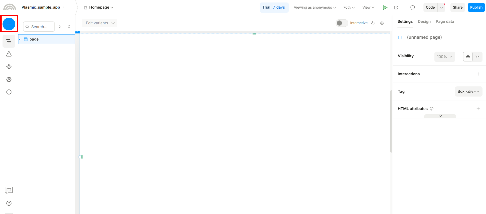{: width="60%"}    

    !!! success "Tip"
        For each component’s size, we recommend using (%) so the layout can adapt to different display sizes.  
    <br>

    #### Homepage  
    Please refer to the image below to design your homepage layout.  
    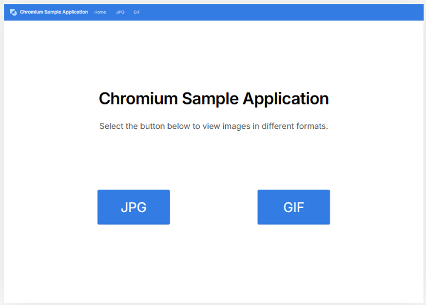{: width="60%"}  

    #### JPG page  
    Click the *+* button shown in the red box to create a new page, then rename it to ***JPG***.  
    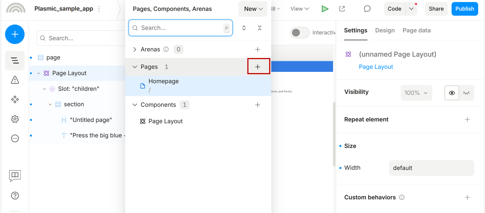{: width="60%"}  

    Please refer to the image below to design your JPG page layout.  
    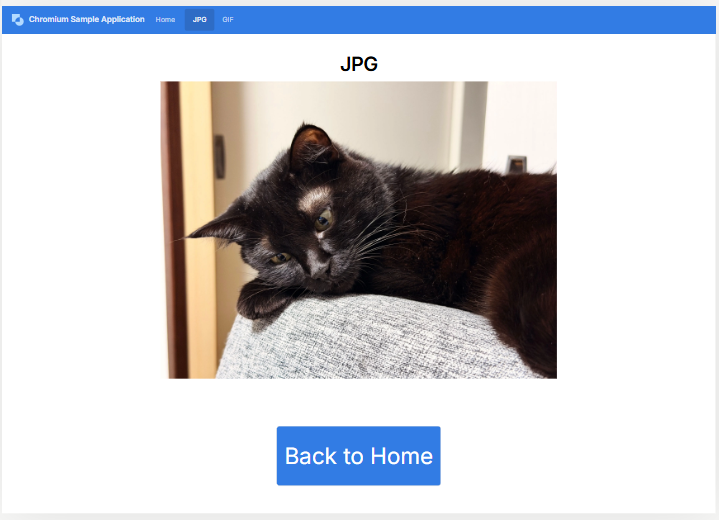{: width="60%"}  

    Click [Display Image File](../packages/Display_Image_File.zip) to download the display image package (including JPG and GIF files), then upload ***Cat.jpg*** via *Settings → Image*, as shown in the red box.    
    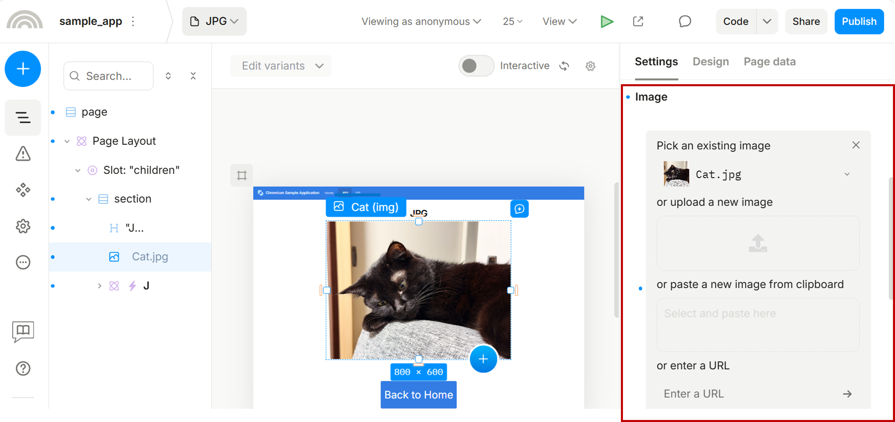{: width="60%"}  

    #### GIF page  
    Duplicate the JPG page and rename it to GIF. Then, refer to the image below to modify your GIF page layout.    
    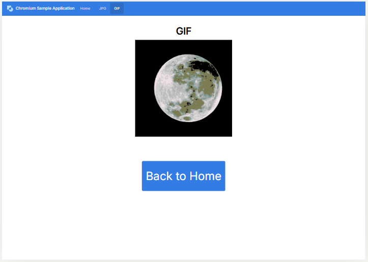{: width="60%"}  

    Upload the Moon.gif file you downloaded from [Display Image File](../packages/Display_Image_File.zip) to the GIF page, as shown in the red box.  
    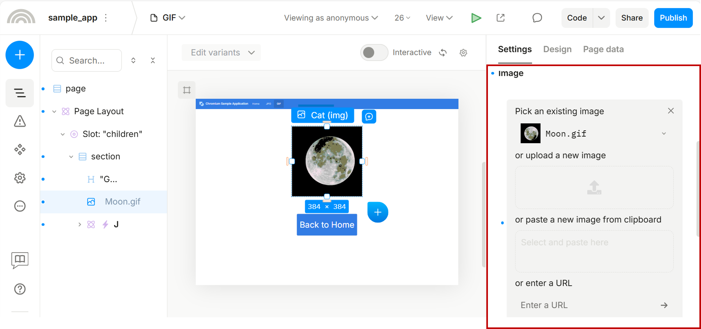{: width="60%"}  
    
    <br>

2. Add navigation flow to each page.  

    #### Homepage  

    - From the Homepage to the JPG page:  
        Click the *JPG* button and configure *Settings → Interactions* as shown below.  
        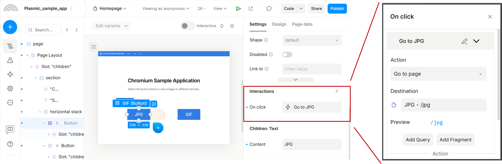{: width="60%"}  
        Also refer to the image below to adjust the *Design* settings, especially the *Effects* section highlighted in the red box.    
        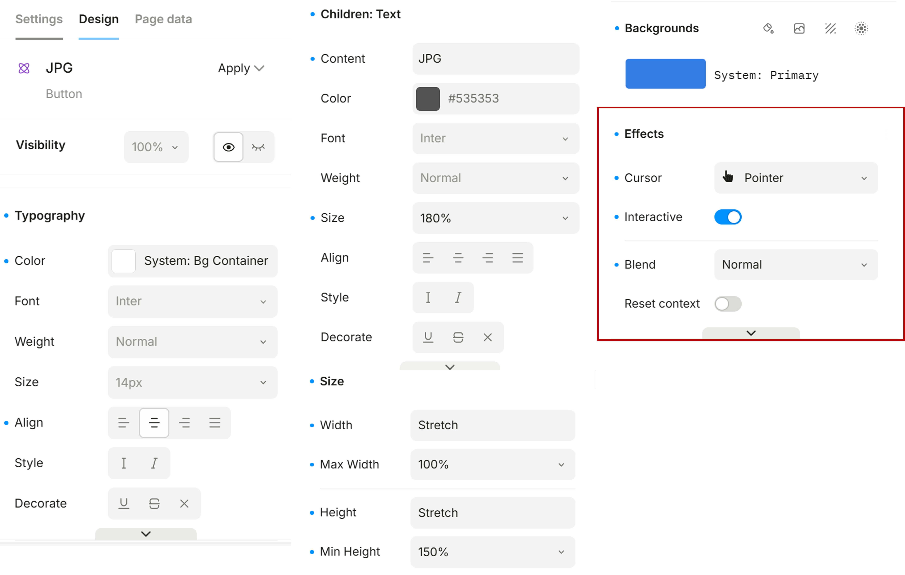{: width="60%"}    

    - From the Homepage to the GIF page:  
        Please apply a similar setup based on the procedure above, but change *Settings → Interactions* from *Go to page (JPG)* to *Go to page (GIF)*.  

    #### JPG page 

    - From the JPG page to Homepage  
        Click the *Back to Home* button and configure *Settings → Interactions* as shown below.  
        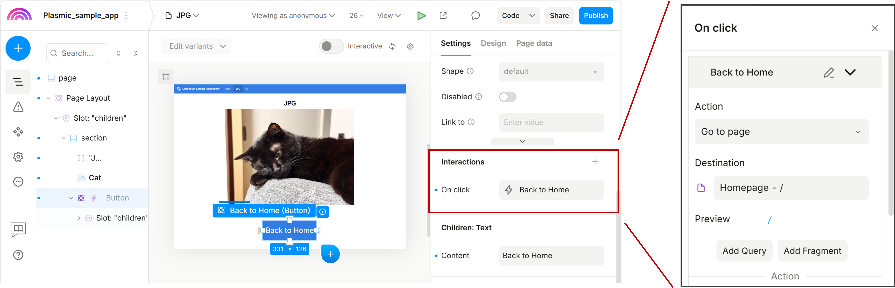{: width="60%"}  
        
        Also refer to the image below to adjust the *Design* settings, especially the *Effects* section highlighted in the red box.    
        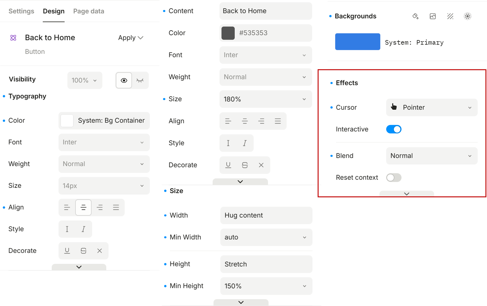{: width="60%"}    

    #### GIF page  

    - From the GIF page to Homepage  
        Please apply the same setup to the Back to Home button based on the procedure above.  


## Step 2: Create React App and Connect Plasmic  

!!! success "Tip"
    A Linux PC is required from this step.

### 2-1. Install equired environment   

1. Install npm.    

    Run the following command to install npm on your Linux PC.  

    ```bash
    sudo apt install npm
    ```
    { .dollar }


    Run `npm` in the command prompt and confirm that the following output is displayed.   

    ```bash
    npm <command>

    Usage:

    npm install        install all the dependencies in your project
    npm install <foo>  add the <foo> dependency to your project
    npm test           run this project's tests
    npm run <foo>      run the script named <foo>
    npm <command> -h   quick help on <command>
    npm -l             display usage info for all commands
    npm help <term>    search for help on <term>
    npm help npm       more involved overview
    ``` 

2. Install Node.js (via nvm).  

    Run the following command to install `nvm` ([https://github.com/nvm-sh/nvm](https://github.com/nvm-sh/nvm)).

    ```bash
    wget -qO- https://raw.githubusercontent.com/nvm-sh/nvm/v0.40.3/install.sh | bash
    ```
    { .dollar }

    Node.js version 22.17.0 or later is required. Use nvm to install and switch to the appropriate Node.js version.  
    Install Node.js (v22.17.0) using the following command.  

    ```bash
    nvm install v22.17.0
    ```
    { .dollar }
    
    ```bash
    nvm use v22.17.0
    ```
    { .dollar }
    
    The setup is complete when you see `Now using node v22.17.0 (npm v10.9.2)`.

3. Install Plasmic CLI.  

    ```bash
    npm install -g @plasmicapp/cli
    ```
    { .dollar }


### 2-2. Create React Application Connect Plasmic    

1. Create React App.

    ```bash
    npx create-react-app Plasmic_sample_app
    cd Plasmic_sample_app
    ```
    { .dollar }  

2. Initialize Plasmic.  

    ```bash
    npx @plasmicapp/cli auth
    npx @plasmicapp/cli init
    ```
    { .dollar }   

    Accept defaults.  

3. Sync Plasmic project.

    ```bash
    npx @plasmicapp/cli sync --projects <your-project-id>
    ```
    { .dollar }   

    !!! success "Tip"
        Check the address bar of your Plasmic project to find the project ID.  

        For example:
        `https://studio.plasmic.app/projects/3LLFS5U8JLrzi1w2ibGFHs/-/Homepage?...`  

        The string after /projects/ (e.g., `3LLFS5U8JLrzi1w2ibGFHs`) is your project ID.  

4. Install router.

    ```bash
    npm install react-router-dom
    ```
    { .dollar }


## Step 3: Run the Plasmic Sample Application and Verify Locally  

1. Setup App.js.  

    ```bash
    cd <path-to>/Plasmic_sample_app/src/
    ```
    { .dollar }

    Replace the contents of App.js with the following code:  

    ```bash title="App.js"
    --8<-- "./docs/wiki/_codes/plasmic/App.js"
    ```
    
2. Run the Plasmic project locally.  

    ```bash
    npm start
    ```
    { .dollar }

    If the setup is correct, you should see output similar to the following.  
    ```bash
    Compiled successfully!

    You can now view plasmic_app in the browser.

    Local:            http://localhost:3000
    On Your Network:  http://10.166.28.19:3000

    Note that the development build is not optimized.
    To create a production build, use npm run build.

    webpack compiled successfully
    ```

    Click the URL to view your Plasmic sample application in the browser.  

    Check:  
    - UI matches Plasmic  
    - Navigation works  

3. Update flow.

    If you are not satisfied with the UI design, you can update it in your Plasmic project.  
    After making changes, sync latest changes to pull the updates.  

    ```bash
    npx @plasmicapp/cli sync
    ```
    { .dollar }

    Then re-run locally.

    ```bash
    npm start
    ```
    { .dollar }


## Step 4: Build the Chromium Sample Application    

Build the Plasmic project using the following command.  

```bash
npm run build
```
{ .dollar }

A successful build will show messages similar to:

```bash

> plasmic_app@0.1.0 build
> react-scripts build

Creating an optimized production build...
Compiled successfully.

File sizes after gzip:

369.48 kB  build/static/js/main.d5975c8f.js
9.75 kB    build/static/css/main.c578c552.css
1.76 kB    build/static/js/453.5f6ea413.chunk.js

The project was built assuming it is hosted at /.
You can control this with the homepage field in your package.json.

The build folder is ready to be deployed.
You may serve it with a static server:

npm install -g serve
serve -s build

Find out more about deployment here:

https://cra.link/deployment

```

After the build completes, a `build` directory will be created in your `Plasmic_sample_app` directory.  

The directory structure under `Plasmic_sample_app/` should look like the following:  

```bash
.
├── build
├── node_modules
├── package.json
├── package-lock.json
├── plasmic.json
├── plasmic.lock
├── public
├── README.md
└── src
```

And the directory structure under `Plasmic_sample_app/build/` should look like the following:  

```bash
.
build/
├── asset-manifest.json
├── favicon.ico
├── index.html
├── logo192.png
├── logo512.png
├── manifest.json
├── robots.txt
└── static
    ├── css
    ├── js
    └── media

4 directories, 7 files
```


    
## Step 5. Deploy the Chromium Sample Application

1.  Insert your SD card into the Linux PC and mount it.

    !!! warning "Notice"
        Make sure to turn off your EVK board before ejecting the SD card.  
        
        To power off the board, execute the `shutdown -h now` command in the terminal. Once the screen turns black, press and hold the power button (red button) for approximately 2 seconds to complete the shutdown process.
        

2.  Copy the built web application files to your SD card.
    
    !!! success "Tip"
        - On your Linux PC, the plasmic sample applications are now located at:  
        `<path-to>/Plasmic_samples_app/build`  
        - We recommend deploying the application to the following directory on your EVK board:   
        `/usr/share/chromium_demo/`
        - Follow the instructions in [Getting Started - Step 4 in Option 2](../../getting_started/#option-2-for-linux-pc-ubuntu) to check where your SD card is mounted using the `#!bash lsblk` command.  

    Create a new directory for the Plasmic sample application.  

    ```bash
    cd <sdcard-mount-point>/usr/share/chromium_demo/
    ```
    { .dollar }

    ```bash
    sudo mkdir Plasmic_sample_app 
    ```
    { .dollar }

    Copy the Plasmic sample application files:

    ```bash
    cd <path-to>/Plasmic_sample_app
    ```
    { .dollar }

    ```bash
    sudo cp -r build/ <sdcard-mount-point>/usr/share/chromium_demo/Plasmic_sample_app
    ```
    { .dollar }

3. Create a custom Python server and copy it to your SD card.

    <a href="../packages/plasmic/serve-python3.py" download> **Click here** </a> to download the Python server, or copy the following code to create the Python file manually.  

    ```bash title="serve-python3.py"
    --8<-- "./docs/wiki/_codes/plasmic/serve-python3.py"
    ```
    !!! success "Tip"
        For convenience, place `serve-python3.py` in `<sdcard-mount-point>/usr/share/chromium_demo/Plasmic_sample_app/build/` on your target board. 

    The directory structure at
`<sdcard-mount-point>/usr/share/chromium_demo/Plasmic_sample_app` on your target board should look like this:  
    ```bash
    Plasmic_sample_app/
    └── build/
        ...
        ├── index.html
        ...
        ├── static/
        └── serve-python3.py
    ```
    

Please refer to [Step 2: Deploy Sample Applications](../../hmi_applications/#step-2-deploy-sample-applications) if you want to deploy over ethernet (using SCP).


## Step 6. Run the Chromium Sample Application

1.  Prepare the necessary equipment and configure the EVK DIP switches by following the instructions in [Hardware Setup](../../hmi_applications/#hardware-setup).

2.  Insert the bootable microSD card created in [Step 5](../chromium_develop-hmi-using-plasmic/#step-5-deploy-the-chromium-sample-application) into the microSD card slot, and then power on the EVK board.

    !!! success "Tip"
        *  Please refer to the [EVK Peripheral Setup](../../hmi_applications/#evk-peripheral-setup) to locate the microSD card slot based on your selected boot mode.
        *  Press and hold the power button (red button) for 1 second to turn on the EVK board.

3. Use the following command on your EVK board to run the Chromium sample application.

    Start server.

    ```bash
    cd usr/share/chromium_demo/Plasmic_sample_app
    ```
    {: .hash }  

    ```bash
    python3 serve-python3.py 8000 &
    ```
    {: .hash }

    Launch Chromium:  

    ```bash
    chromium --no-sandbox --in-process-gpu http://127.0.0.1:8000/
    ```
    {: .hash }

    The launched sample application is shown below.  
    Homepage  
    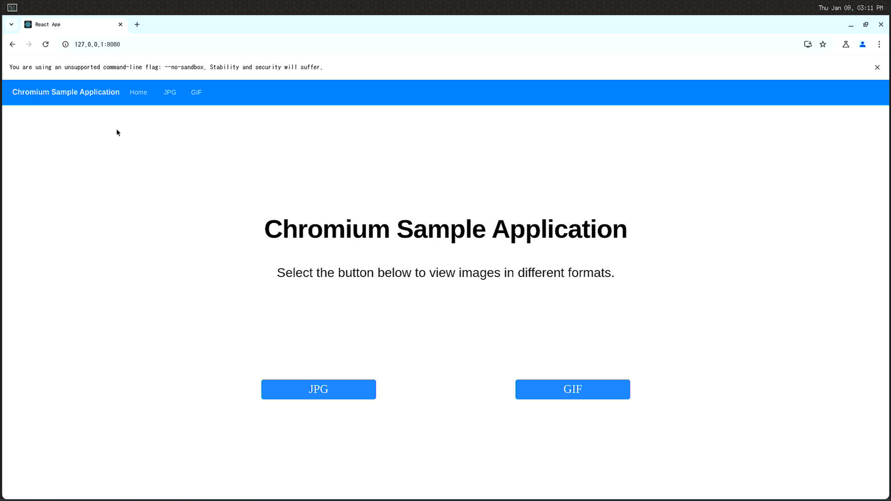{: width="60%"}  

    Click the JPEG button, you will get:
    JPG page  
    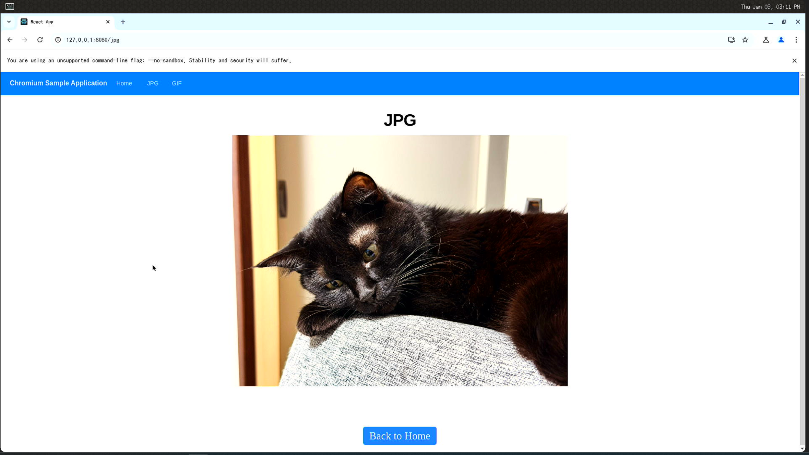{: width="60%"}  

    Click the GIF button, you will get:
    GIF page  
    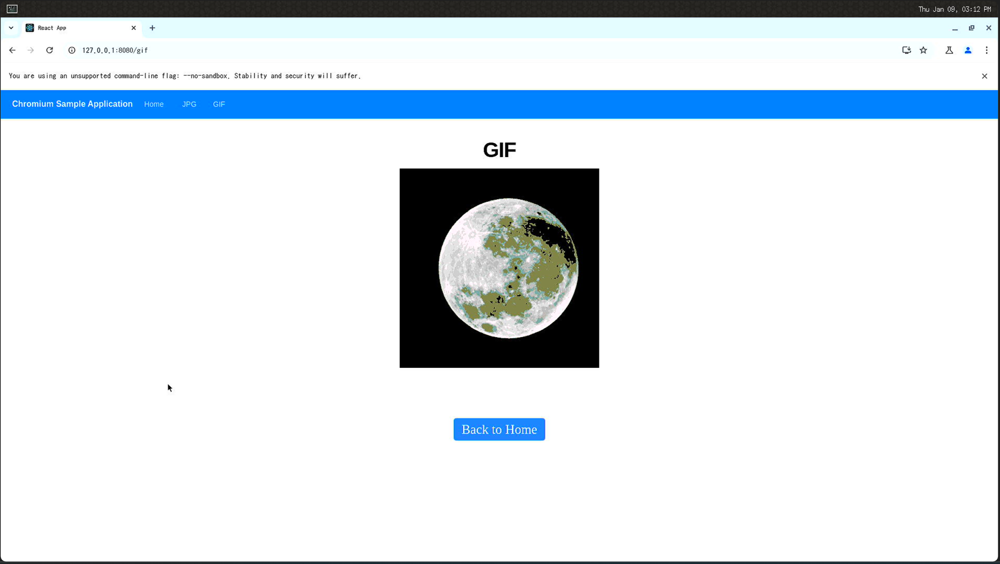{: width="60%"}  

<br>
Once you have successfully tried this simple Plasmic sample application, you’re ready to start designing your own Chromium applications.