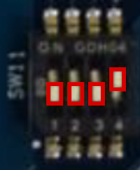
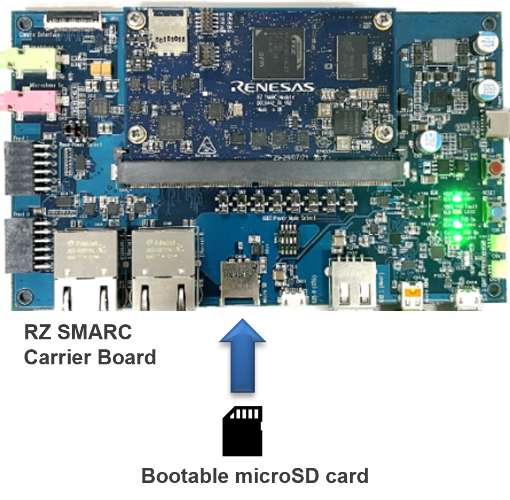

# How to Boot from a microSD Card in QSPI Boot Mode

!!! abstract "Page Information"
    The information provided on this page has been verified using the following SDK versions and evaluation kits (EVKs):

    - ***HMI SDK v2.3.1.0 (Yocto 3.1.31 (dunfell), kernel 5.10) using RZ/G2L, RZ/G2LC, and RZ/G2UL EVK***

    Last updated: ***December 23, 2025***

This page describes how to boot Linux of the HMI SDK from a microSD card in QSPI boot mode.

Please note that you need to update bootloaders in Flash ROM on the EVK to use the QSPI boot mode. 
In the eSD boot mode, bootloaders stored in the microSD card are used, but bootloaders stored in the ROM are used when you use the QSPI boot mode. 
For information about how to update bootloaders, see [How to Update Firmware (Flash Writer and Bootloaders)](./common_update-firmware.md).


## 1. Create a bootable microSD card

Get a microSD card ready. For information about requirements for the microSD card, see [Necessary Equipment](hmi_applications/#necessary-equipment).
And for information about how to create a bootable microSD card, see [Step 4: Create SD Cards with the Prebuilt Image](../../getting_started/#step-4-create-sd-cards-with-the-prebuilt-image).


## 2. Set boot mode to QSPI boot mode

To use QSPI boot mode, set the SW11 as follows.

!!! content-wrapper no-indent table-no-sort table-no-hover ""
	{ align=left .switch-icon }

	|     SW11-1     |     SW11-2     |    SW11-3    |     SW11-4     |
	|:--------------:|:--------------:|:------------:|:--------------:|
	| OFF {: .red }  | OFF {: .red }  | OFF {: .red} | ON {: .green } |


## 3. Set bootable microSD card

Insert the bootable microSD card into the card slot on RZ SMARC Carrier Board.



!!! note
	Please note that the card slot is different from a card slot used for eSD boot.

## 4. Boot Linux on the board

Press and hold power button (SW9) for 1 second to turn on the EVK.
You will see the following messages in the console.

```
U-Boot 2021.10 (Dec 15 2023 - 06:47:44 +0000)

CPU:   Renesas Electronics CPU rev 1.0
Model: smarc-rzg2l
DRAM:  1.9 GiB
MMC:   sd@11c00000: 0, sd@11c10000: 1
Loading Environment from MMC... OK

In:    serial@1004b800
Out:   serial@1004b800
Err:   serial@1004b800
U-boot WDT started!
Net:   
Error: ethernet@11c20000 address not set.
No ethernet found.

Hit any key to stop autoboot:  2  1  0 
switch to partitions #0, OK
mmc1 is current device
19857920 bytes read in 1229 ms (15.4 MiB/s)
39079 bytes read in 6 ms (6.2 MiB/s)
Moving Image from 0x48080000 to 0x48200000, end=49350000
## Flattened Device Tree blob at 48000000
   Booting using the fdt blob at 0x48000000
   Loading Device Tree to 0000000057ff3000, end 0000000057fff6fc ... OK

Starting kernel ...

[    0.000000] Booting Linux on physical CPU 0x0000000000 [0x412fd050]
[    0.000000] Linux version 5.10.184-cip36-yocto-standard (oe-user@oe-host) 
...
    (omitted)
...

Poky (Yocto Project Reference Distro) 3.1.26 smarc-rzg2l ttySC0

BSP: RZG2L/RZG2L-SMARC-EVK/3.0.6-update3
LSI: RZG2L
Version: 3.0.6-update3
smarc-rzg2l login: root
root@smarc-rzg2l:~#
```

You can login as root without password.

!!! note
	The messages in the console depend on the EVK and software that you are using.

If you are faced with an error in the boot process, it may be caused by u-boot configuration.
See [Configure U-boot](../../wiki/common_qspi-boot-mode/#configure-u-boot).

## 5. Shutdown 

To shut down the system, run _shutdown_ command as follows.

```bash
shutdown -h now
```
{.hash}

After you executing the _shutdown_ command, it shuts down the system immediately.
And when it completes, you will see the following message.

```
reboot: Power down
```

Then, press and hold power button (SW9) for 2 seconds to turn off the EVK.


## Appendix

### Configure U-boot

U-boot is configured for QSPI/SD boot mode by default.
But if you used other modes, the configuration has been changed.
In that case, initialize U-boot configuration as follows.

Turn on the EVK, and hit any key to stop autoboot after you see the following messages in the console.

	U-Boot 2021.10 (Mar 31 2022 - 03:57:20 +0000)

	CPU: Renesas Electronics K rev 16.10
	Model: smarc-rzg2l
	DRAM: 1.9 GiB
	MMC: sd@11c00000: 0, sd@11c10000: 1
	Loading Environment from MMC... OK
	In: serial@1004b800
	Out: serial@1004b800
	Err: serial@1004b800
	Net:
	Error: ethernet@11c20000 address not set.
	No ethernet found.

	Hit any key to stop autoboot: 

Then, input the following command to restore the default configuration.

```bash
env default -a
```
{.diamond}

Save the configuration by _saveenv_ command.

```bash
saveenv
```
{.diamond}

To start Linux on the EVK, press reset switch (SW10).


