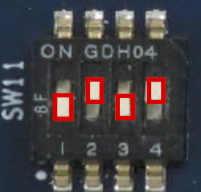

# Update firmware (bootloaders) on EVK

When you use QSPI boot mode or eMMC boot mode, you should update firmware (bootloaders).
This page describes how to write flash writer and bootloaders.
To write flash writer and bootloaders, you need to connect your PC to the EVK with a USB serial cable.
See ["Setup EVK's peripheral"](../../getting_started/#1-setup-evks-peripheral).
And The following tools are used in this instructions. Please install them to your PC in advance.

=== "Windows PC"

	[Tera Term (terminal software)](https://github.com/TeraTermProject/teraterm/releases)

	[FTDI VCP driver](https://www.ftdichip.com/Drivers/VCP.htm)

=== "Linux PC"

	[minicom](https://help.ubuntu.com/community/Minicom)

For information about how to use use QSPI boot, see [Boot Linux from microSD card](../common_boot-linux-from-sd/).
And for information about how to use eMMC boot, refer to [RZ/G2L, RZ/G2LC and RZ/G2UL-EVKIT Linux Start-up Guide](https://www.renesas.com/ja/document/gde/smarc-evk-rzg2l-rzg2lc-rzg2ul-linux-start-guide-rev105?r=1467991).

## 1. Set boot mode to SCIF download mode

Turn off the power of EVK, then set the SW11 as follows.

!!! content-wrapper no-indent table-no-sort table-no-hover ""
	{ align=left .switch-icon }

	|     SW11-1     |     SW11-2     |    SW11-3    |     SW11-4     |   
	|:--------------:|:--------------:|:------------:|:--------------:|
	| OFF {: .red }  | ON {: .green } | OFF {: .red} | ON {: .green } | 


## 2. Configure terminal software

Configure the setting of serial communication on terminal software as follows:

* Speed: 115200 bps
* Data: 8bit
* Parity: None
* Stop bit: 1 bit
* Flow control: None

## 3. Prepare flash writer and bootloaders

The flash writer and the bootloaders are stored in the pre-built binaries pacakge of the HMI SDK. 
See [file contents](../..//overview/#file-contents).

Unzip the pre-built binaries package to pick up flash write and bootloaders as follows:

=== "RZ/G2L"

	```bash
	unzip pre-built-binary_rzg2l_hmi-sdk_v*.zip
	```
	{: .dollar }

	* Flash writer
		* Flash_Writer_SCIF_RZG2L_SMARC_PMIC_DDR4_2GB_1PCS.mot

	* Bootloaders
		* bl2_bp-smarc-rzg2l_pmic.srec
		* fip-smarc-rzg2l_pmic.srec

=== "RZ/G2LC"

	```bash
	unzip pre-built-binary_rzg2lc_hmi-sdk_v*.zip
	```
	{: .dollar }

	* Flash writer
		* Flash_Writer_SCIF_RZG2LC_SMARC_DDR4_1GB_1PCS.mot

	* Bootloaders
		* bl2_bp-smarc-rzg2lc.srec
		* fip-smarc-rzg2lc.srec

=== "RZ/G2UL"

	```bash
	unzip pre-built-binary_rzg2ul_hmi-sdk_v*.zip
	```
	{: .dollar }

	* Flash writer
		* Flash_Writer_SCIF_RZG2UL_SMARC_DDR4_1GB_1PCS.mot

	* Bootloaders
		* bl2_bp-smarc-rzg2ul.srec
		* fip-smarc-rzg2ul.srec

## 4. Download flash writer to RAM

Turn on the power of the EVK by pressing SW9. The messages below are shown on the terminal.

```
 SCIF Download mode
 (C) Renesas Electronics Corp.
-- Load Program to System RAM ---------------
please send !
```

Send an image of flash writer using terminal software after the message "please send !" is shown.

=== "Windows PC (Tera Term)"

	Open the "File" menu, then select "Send file..." to open "Send file" dialg.

	Select the flash writer image in the dialog, and press "Open" button.

=== "Linux PC (minicom)"

	Press "Ctrl + A", and "S", then select "ascii" for upload mode.

	Select the flash writer image file.

	Press any key when upload is completed.

After successfully downloading the image, the flash writer starts automatically and shows a message like below on the terminal.
```
Flash writer for RZ/G2 Series V1.06 Aug.10,2022                                                    
 Product Code : RZ/G2UL Type1   
>
```

## 5. Write the bootloaders

### 5-1. Change baud rate of serial port

Before writing the loader files, change the flash writer transfer rate from default (115200bps) to high speed (921600bps) with "SUP" command.
```bash
SUP
```
{: .diamond}

After the "SUP" command, change the serial communication protocol speed from 115200bps to 921600bps on the terminal software.

### 5-2. Write bl2 file

Execute "XLS2" command to write boot loader binary files. 
```bash
XLS2
```
{: .diamond}

This command receives binary data from the serial port and writes the data to a specified address of the Flash ROM with information where the data should be loaded on the address of the main memory. 
Set the following addresses respectively.

* Address to load to RAM: H'11E00
* Address to save to ROM: H'00000

For example:
```
>XLS2                                                                                              
===== Qspi writing of RZ/G2 Board Command =============                                            
Load Program to Spiflash                                                                           
Writes to any of SPI address.                                                                      
 Dialog : AT25QL128A                                                                               
Program Top Address & Qspi Save Address                                                            
===== Please Input Program Top Address ============                                                
  Please Input : H'11E00                                                                           
                                                                                                   
===== Please Input Qspi Save Address ===                                                           
  Please Input : H'00000                                                                           
Work RAM(H'50000000-H'53FFFFFF) Clear....                                                          
please send ! ('.' & CR stop load)
```

Send the data of "bl2_bp-smarc-rzg2*.srec" from terminal software in the same way as the flash writer after the message "please send !" is shown. 
For the actual file name of bl2 file, see [3. Prepare flash writer and bootloaders](#3-prepare-flash-writer-and-bootloaders).

In the case that the following message is shown, enter 'y'.
```
SPI Data Clear(H'FF) Check :H'00000000-0000FFFF,Clear OK?(y/n)
```

After writing the data is completed, the following messages like below are shown on the terminal.
```
SPI Data Clear(H'FF) Check :H'00000000-0000FFFF Erasing..Erase Completed 
SAVE SPI-FLASH.......
======= Qspi  Save Information  =================
 SpiFlashMemory Stat Address : H'00000000
 SpiFlashMemory End Address  : H'0000CA38
===========================================================

>
```

### 5-3. Write fip file

Execute "XLS2" command to write fip file. 
```bash
XLS2
```
{: .diamond}

Set the following addresses respectively for the fip file.

* Address to load to RAM: H'00000
* Address to save to ROM: H'1D200

For example:
```
>XLS2
===== Qspi writing of RZ/G2 Board Command =============
Load Program to Spiflash
Writes to any of SPI address.
 Dialog : AT25QL128A
Program Top Address & Qspi Save Address 
===== Please Input Program Top Address ============
  Please Input : H'00000
 
===== Please Input Qspi Save Address ===
  Please Input : H'1D200
Work RAM(H'50000000-H'53FFFFFF) Clear....
please send ! ('.' & CR stop load)
```

Send the data of "fip-smarc-rzg2*.srec" from terminal software in the same way as the flash writer after the message "please send !" is shown. 
For the actual file name of fip file, see [3. Prepare flash writer and bootloaders](#3-prepare-flash-writer-and-bootloaders).

In the case that the following message is shown, enter 'y'.
```
SPI Data Clear(H'FF) Check :H'00010000-000DFFFF,Clear OK?(y/n)
```

After writing the data is completed, the following messages like below are shown on the terminal.
```
SPI Data Clear(H'FF) Check :H'00010000-000DFFFF Erasing..............Erase Completed 
SAVE SPI-FLASH.......
======= Qspi  Save Information  =================
 SpiFlashMemory Stat Address : H'0001D200
 SpiFlashMemory End Address  : H'000DD9EF
===========================================================

>
```

### 5-4. Restore baud rate of serial port

After writing two loader files is completed, restore the serial communication protocol speed to 115200bps on the terminal software.
Then, turn off the power of the board by pressing the SW9.

