# How to Develop Flutter HMI Applications Using FlutterViz

!!! abstract "Page Information"
    The information provided on this page has been verified using the following SDK versions and evaluation kits (EVKs):

    - ***HMI SDK v3.4.0.0 (Yocto 5.0.9 (scarthgap), kernel 6.1) using RZ/G3E EVK***

    Last updated: ***January 30, 2026***

[FlutterViz](https://flutterviz.com/) is easy to use interface with Flutter Drag and Drop UI builder to quickly kick-start your project. This open-source project aims to empower developers by providing a free and extensible visual Flutter UI builder.

This guide describes how to use FlutterViz, a web-based visual UI builder, to develop Flutter HMI applications. For more information about FlutterViz, see the [FlutterViz GitHub repository](https://github.com/iqonic-design/flutter_viz).

## Step 1: Create Flutter Applications Using FlutterViz

### 1-1. Create an account and log in

Open [FlutterViz](https://flutterviz.com/) and click *GET INVITE* to obtain the invitation code required to create an account.
{: width="60%"}  

Enter a username and your email address, then click GET INVITE.  
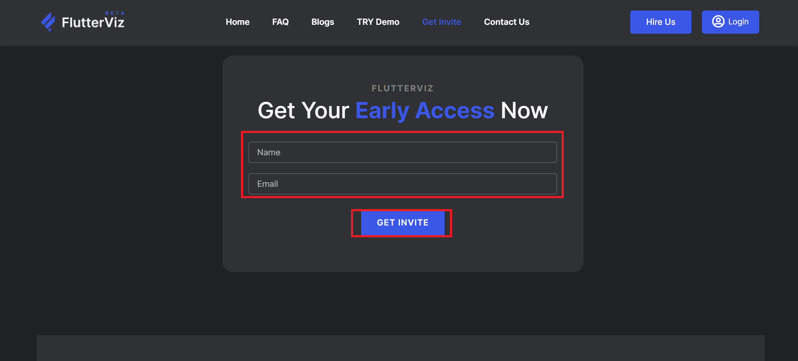{: width="60%"}  

The invitation code will be sent to the email address you entered.  

!!! success "Tip" 
    Note that it may take up to one week to receive the invitation code.  

Once you receive the code, click *Login*, then select *Click here to Sign Up* to create a new account.  
{: width="60%"}  
{: width="60%"}    
Enter your username, email address, password, and the invitation code you received, then click *Sign Up*.  
{: width="60%"}     

### 1-2. Create a new project

After creating a new account, select *Create New Project*.    
{: width="60%"}  

Select the template to use. This guide uses the *News* template.   
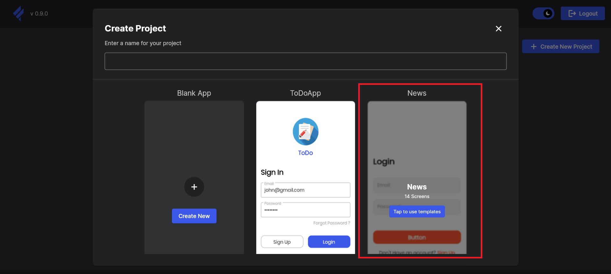{: width="60%"}  

Enter your project name, then click *Tap to use templates*.  
{: width="60%"}  


### 1-3. Create screens

#### Image File Selection Screen

1. Deleting and Adding Objects  

    - Deleting

        Press the {: width="2%"} button on the right and click *RegisterScreen*.  
        {: width="60%"}  

        Delete everything shown in the red boxes. Select each item and right-click *Delete widget*. Keep the *Column* object.   
        {: width="60%"}  


    - GIF and JPEG Button  
        Drag and drop two *Text Buttons* from *Base Widget* onto the text display area where “Have an account?” is located, and then delete that text.   
        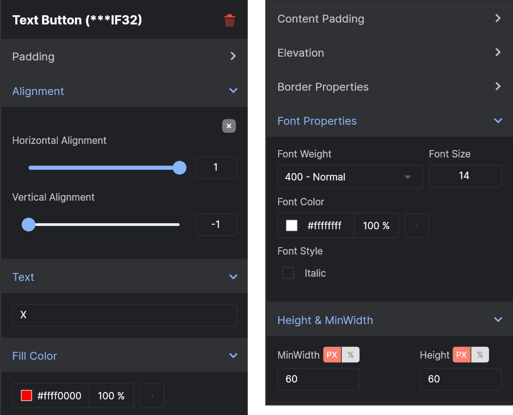{: width="60%"}    


    - GIF and JPEG Display Area    
        Drag and drop the *Container* from the *Layout Widget* below the two buttons.    
        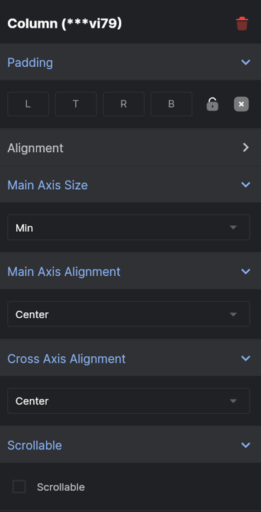{: width="60%"}  


    - "X" Button  
        Drag and drop the *Text Button* from the *Base Widget* below the container.  
        {: width="60%"}  
        
        
    Select the *Column* object and uncheck the *Scrollable* option.  
    {: width="60%"}  


    <br>

2. Resizing Objects

    - Operation Guide Text 

        Click the *Create new* text, then check options from the right-side panel.  
        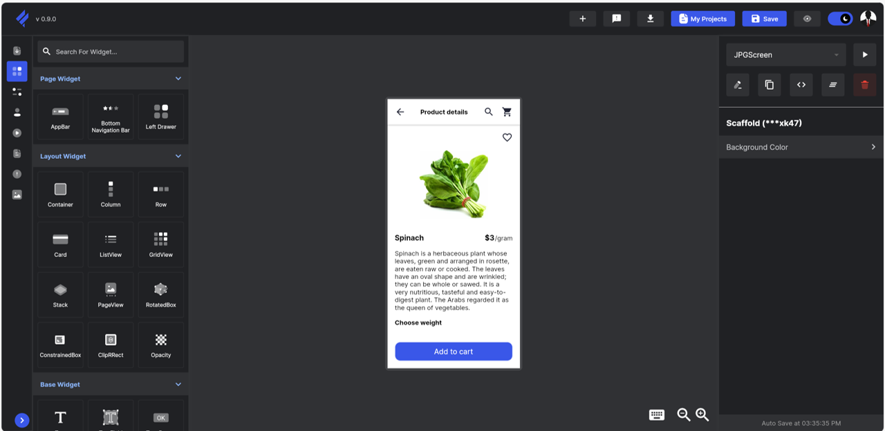{: width="60%"}  

        Change the text from "Create New" to "Flutter Sample Application" in the *Text* feild.  
        {: width="60%"}

        Set the Font size to 24 in the *Font Weight & Size* option.  
        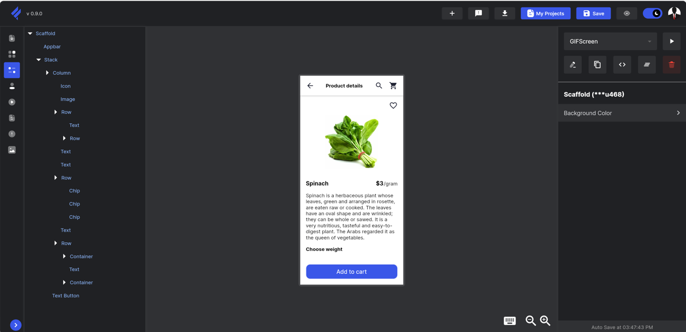{: width="60%"}  

        Click the *account* text, then check options from the right-side panel.     
        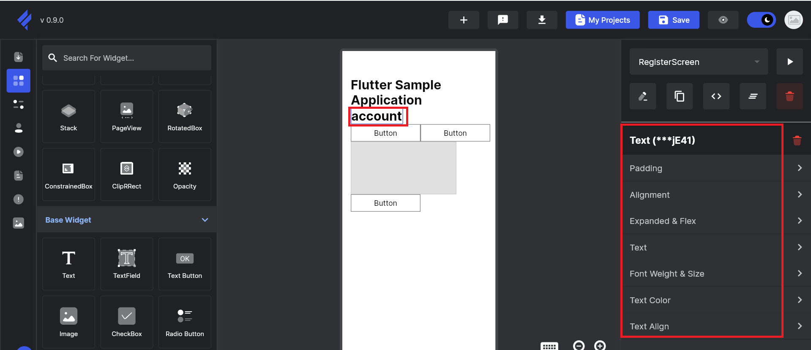{: width="60%"}  

        Change the text from "account" to "Choose a button to display an image"in the *Text* feild.  
        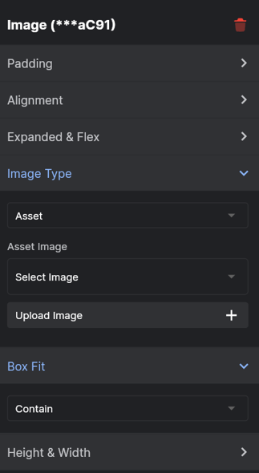{: width="60%"}  

        Set the Font size to 24 in the *Font Weight & Size* option.    
        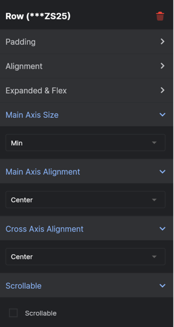{: width="60%"}  


    - "X" Button

        Right-click the bottom *Text button* and press Move Up (^ key) to bring it to the topmost position among the visible objects. Then check options from the right-side panel.   
        {: width="60%"}  

        Set the *Fill Color* to #fff90505.  
        {: width="60%"}  

        Enter "X" in the *Text* feild.  
        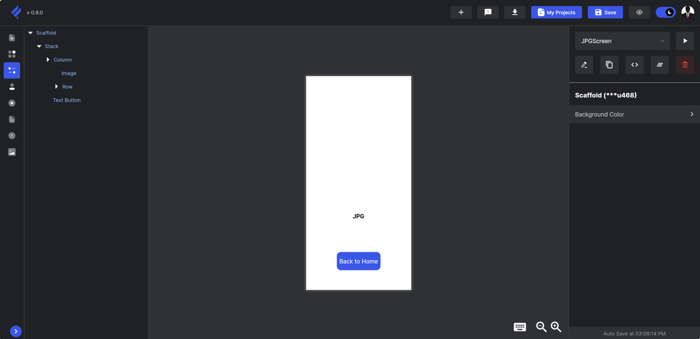{: width="60%"}  

        Set the *Font Color* in *Font Properties* to #ffffffff.  
        {: width="60%"}  

        Set Height to 40 and MinWidth to 40 in the *Height & MinWidth* section.  
        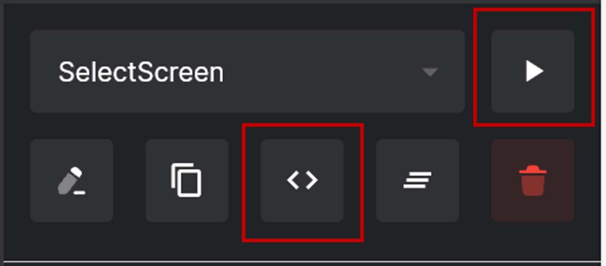{: width="60%"}  


    - JPEG Button

        Click the left *Text button*, then check options from the right-side panel.    
        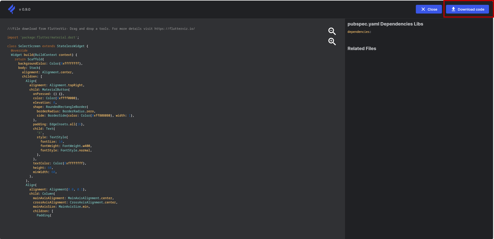{: width="60%"}  

        Enter "JPEG" in the *Text* field.  
        {: width="60%"}  

        Set the *Font Color* in *FontProperties* to #ffffffff.  
        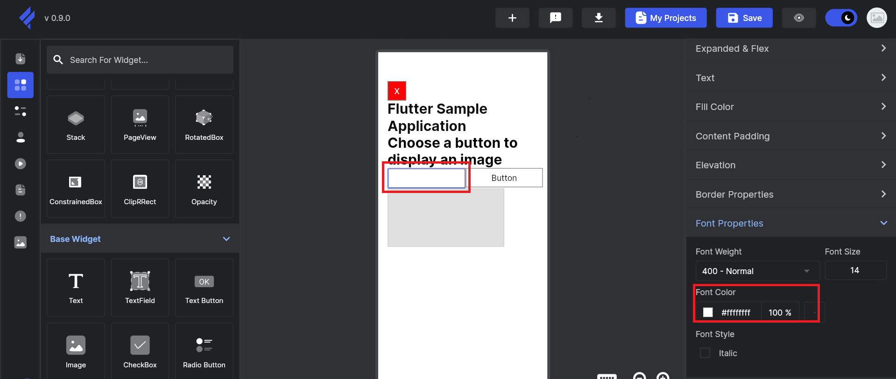{: width="60%"}  

        Set the MinWidth to 125 and Height to 70 in the *Height & MinWidth* section.    
        {: width="60%"}  


    - GIF Button

        Click the right *Text button*, then check options from the right-side panel.    
        {: width="60%"}  

        Enter "GIF" in the *Text* field.  
        {: width="60%"}  

        Set the *Font Color* in *FontProperties* to #f4ffffff.  
        {: width="60%"}  

        Set the MinWidth to 125 and Height to 70 in the *Height & MinWidth* section.    
        {: width="60%"}  


    - GIF and JPEG Display Area  

        Click the *Container*, then check options from the right-side panel.  
        {: width="60%"}  

        Set the *Fill Color* to #1ffffffff.  
        {: width="60%"}  

        Set Width to 300 and Height to 100 in the *Height & Width* section.  
        {: width="60%"}  


    <br>

3. Changing Object Positions

    - Operation Guide Text  

        Click the "Choose a button to display an image" text, then check options from the right-side panel.  
        Enable *Expanded* in *Expanded & Flex* section, then set *Horizontal Alignment* to -0.32 and *Vertical Alignment* to -0.73 in *Alignment* section.  
        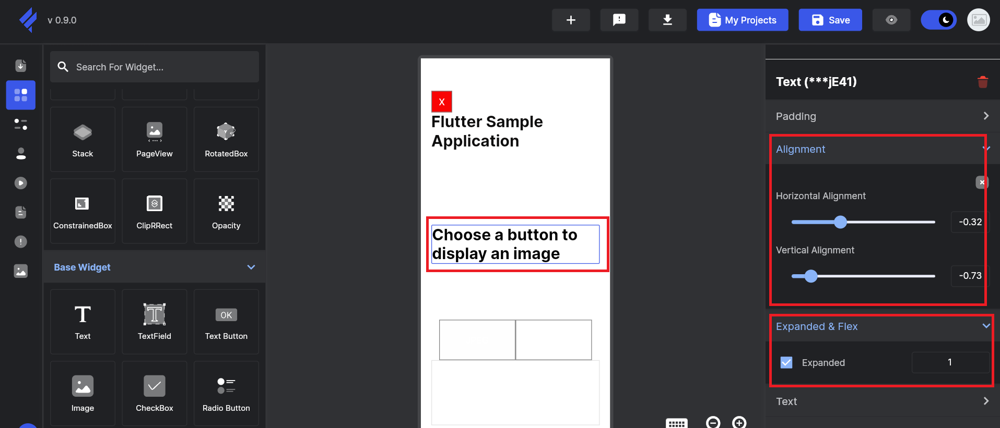{: width="60%"}  

        Click the "Flutter Sample Application" text, then check options from the right-side panel.  
        Enable *Expanded* in *Expanded & Flex* section, then set *Horizontal Alignment* to -0.33 and *Vertical Alignment* to 0.77 in *Alignment* section.  
        {: width="60%"}  


    - JPEG Button  

        Click the "JPEG" text button (left one), then check options from the right-side panel.  
        Enable *Expanded* in *Expanded & Flex* section, then set *Horizontal Alignment* to 0.08 and *Vertical Alignment* to 0.03 in *Alignment* section.  
        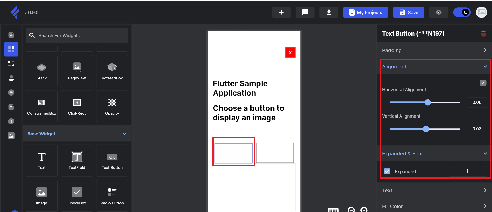{: width="60%"}  


    - GIF Button  

        Click the "GIF" text button (right one), then check options from the right-side panel.  
        Enable *Expanded* in *Expanded & Flex* section, then set *Horizontal Alignment* to 0.08 and *Vertical Alignment* to 0.03 in *Alignment* section.  
        {: width="60%"}


    - GIF and JPEG Display Area  

        Click the container, then check options from the right-side panel.  
        Set Width to 400 and Height to 150 in the *Height & Width* section.  
        {: width="60%"}  
    

    - "X" Button  

        Click the "X" text button, then check options from the right-side panel.
        Set *Horizontal Alignment* to 1.00 in *Alignment* section.  
        {: width="60%"}    


<br><br>

#### Image File Display Screen

1. Deleting and Adding Objects  

    - Deleting
        Press the {: width="2%"} button on the right and click *LoginScreen*.  
        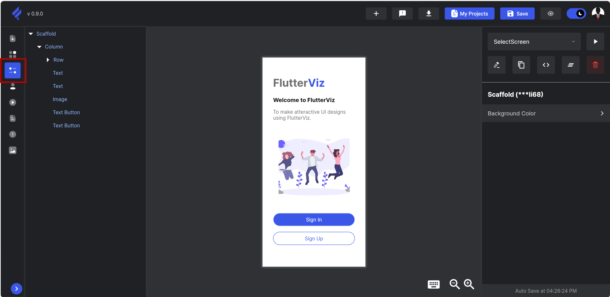{: width="60%"}  

        Delete everything shown in the red boxes. Select each item and right-click *Delete widget*. Only keep the "Don't Have an account?" text and the *Column* object.   
        {: width="60%"}  


    - "X" Button  
        Drag and drop the *Text Button* from the *Base Widget* onto the text display area where “Don't Have an account?” is located, and then delete that text.  
        {: width="60%"}  


    - Back Button  
        Drag and drop the *Text Buttons* from *Base Widget* below the newly added “X” button.   
        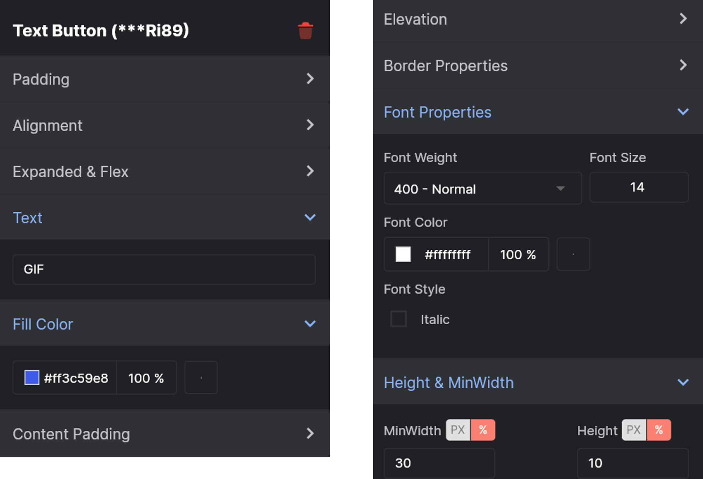{: width="60%"}  


    - Image Display  
        Drag and drop the *Image* from *Base Widget* below the newly added Back button.  
        {: width="60%"}  

    
        
    Select the *Column* object and uncheck the *Scrollable* option.  
    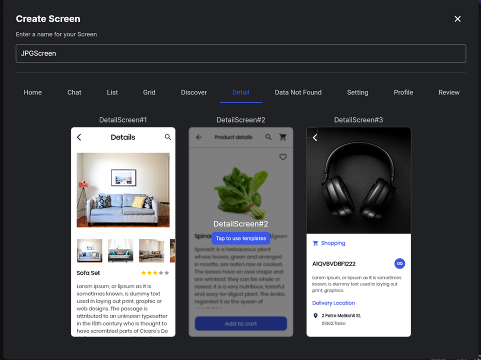{: width="60%"}  

    <br>

2. Resizing Objects

    - "X" Button

        Click the top text button, then check options from the right-side panel.  
        Set MinWidth to 40 and Height to 40 in the *Height & MinWidth* section.  
        {: width="60%"}  

        Set the *Fill Color* to #fffb0303.  
        {: width="60%"}  

        Enter "X" in the *Text* feild.  
        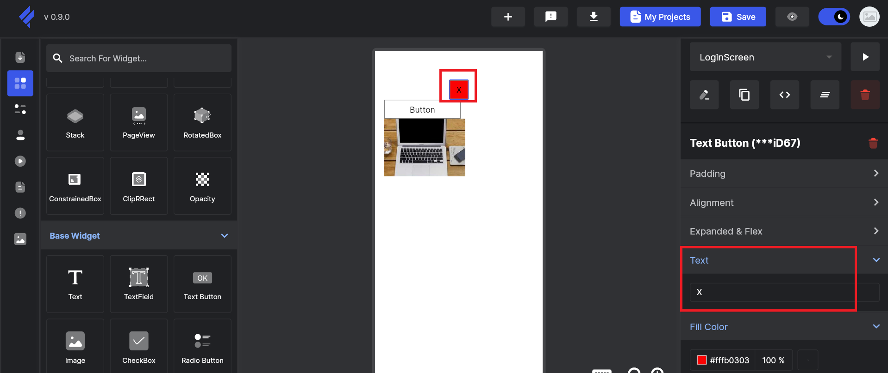{: width="60%"}  

        Set the *Font Color* in *FontProperties* to #ffffffff.  
        {: width="60%"}  


    - Image Display  

        Click the Image, then check options from the right-side panel.  
        Set Width to 200 and Height to 200 in the *Height & Width* section.  
        {: width="60%"}  

        Right-click the Image and press Move Up (^ key) to bring it below the "X" button.     
        {: width="60%"}  


    - Back Button  

        Click the bottom text button, then check options from the right-side panel.  
        Enter "Back" in the *Text* feild, and set MinWidth to 140 and Height to 40 in the *Height & MinWidth* section.   
        {: width="60%"}   

        Set the *Font Color* in *FontProperties* to #ffffffff.  
        {: width="60%"}  


    <br>

3. Changing Object Positions

    - "X" Button  

        Click the "X" text button, then check options from the right-side panel.  
        Enable *Expanded* in *Expanded & Flex* section, then set *Horizontal Alignment* to 1.00 in *Alignment* section.  
        {: width="60%"}   


    - Image Display  

        Click the Image, then check options from the right-side panel.  
        Enable *Expanded* in *Expanded & Flex* section, then set *Horizontal Alignment* to -0.02 and *Vertical Alignment* to -0.32 in *Alignment* section.  
        {: width="60%"}  


    - Back Button 

        Click the Back button, then check options from the right-side panel.  
        Enable *Expanded* in *Expanded & Flex* section, then set *Horizontal Alignment* to 1.00 and *Vertical Alignment* to 0.4 in *Alignment* section.  
        {: width="60%"}  


### 1-4. Export the source file

#### Image File Selection Screen

Select *RegisterScreen* using the {: width="2%"} button on the right, then click the {: width="2%"} to view the source code.  
{: width="60%"}  

Click the *Download code* button to download the source file for the Image File Selection Screen as *RegisterScreen.dart*.   
{: width="60%"}  

<br><br>

#### Image File Display Screen

Select *RegisterScreen* using the {: width="2%"} button on the right, then click the {: width="2%"} to view the source code.  
{: width="60%"}  

Click the *Download code* button to download the source file for the Image File Display Screen as *LoginScreen.dart*.    
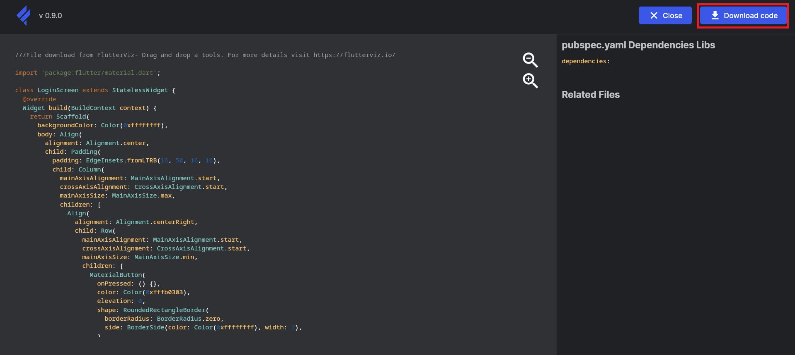{: width="60%"}  


## Step 2: Create the Flutter Sample Application

### 2-1. Apply the downloaded screen source files to the sample application

Rename the Image File Selection Screen source file created in [Step 1](../flutter_develop-hmi-using-flutterviz/#step-1-create-flutter-applications-using-flutterviz) from *`RegisterScreen.dart`* to *`imagefileselection.dart`*.  

Rename the Image File Display Screen source file created in [Step 1](../flutter_develop-hmi-using-flutterviz/#step-1-create-flutter-applications-using-flutterviz) from *`LoginScreen.dart`* to *`imagefiledisplay.dart`*.  

[Click here](../packages/Flutter-Sample-App-Package.zip) to download `Flutter-Sample-App-Package.zip`, extract it, and and copy the *`imagefileselection.dart`* and *`imagefiledisplay.dart`* files into
`Flutter-Sample-App-Package/fluttersampleapp/lib/`.  


### 2-2. Apply the image to be displayed in the sample application

[Click here](../packages/Display_Image_File.zip) to download `Display_Image_File.zip`, and extract it.

Open the extracted *Flutter-Sample-App-Package*. Right-click inside
`Flutter-Sample-App-Package/fluttersampleapp/`, select *New > Folder*, and name the folder ***images***.

Copy *`Cat.jpg`* and *`Moon.gif`* from the *IMAGE_FILE folder* into the newly created *images folder*.


### 2-3. Apply the font to the sample application

[Download FiraCode](https://github.com/tonsky/FiraCode) font, which will be used in this guide, by clicking Download & Install in README.  

Extract the downloaded *Fira_Code_v6.2.zip*.

Open *Flutter-Sample-App-Package*. Right-click inside `Flutter-Sample-App-Package/fluttersampleapp/`, select *New > Folder*, and name the folder ***fonts***.

Copy the following files from the *ttf folder* in *Fira_Code_v6.2* to the *fonts* folder:  

    FiraCode-Bold.ttf  
    FiraCode-Light.ttf  
    FiraCode-Medium.ttf  
    FiraCode-Regular.ttf  
    FiraCode-SemiBold.ttf  


### 2-4. Apply the patch file to the sample application

Move the *fluttersampleapp* folder from *Flutter-Sample-App-Package* to your **Linux PC** using `SCP` or a similar file transfer tool.

Apply the patch file 0001-flutterviz-add.patch. This patch updates `main.dart` and adds navigation logic for the generated screens and buttons.

!!! success "Tip"
    - Replace `<path-to>` with the path on your own setting.

```bash
cd <path-to>/fluttersampleapp
```
{ .dollar }

```bash
patch -p1 < 0001-flutterviz-add.patch
```
{ .dollar }

!!! success "Tip"
    If the patch application fails, you can directly use the files provided in `fluttersampleapp_source` to replace the original files. The related files are:  
    - `fluttersampleapp/lib/main.dart`    
    - `fluttersampleapp/lib/imagefileselection.dart`  
    - `fluttersampleapp/lib/imagefiledisplay.dart`  
    - `fluttersampleapp/pubspec.yaml`  

    [Click here](../packages/fluttersampleapp_source.zip) to download `fluttersampleapp_source.zip`.  


## Step 3: Build the Flutter Sample Application  

1. Enable the cross-compilation Environment.  

    Before building the Flutter sample application, ensure that the cross-compilation toolchain and cross compiler are enabled.  

    Refer to the <span style="color: var(--renesas-primary-color-fg-blue">*first 2 steps*</span> in [Step 1: Build Sample Applications](../../hmi_applications/#step-1-build-sample-applications).

2. Verify the installation of Flutter. 

    !!! success "Tip"
        Unless otherwise specified, **all following steps are performed in the `fluttersampleapp/` directory**.  
        When using commands such as `cd <path-to>/fluttersampleapp/`, replace `<path-to>` with the actual path on your system.

    ```bash
    cd <path-to>/fluttersampleapp
    ```
    { .dollar }

    ```bash
    $OECORE_NATIVE_SYSROOT/usr/share/flutter/sdk/bin/flutter doctor
    ```
    { .dollar }

    !!! success "Tip"
        - `$OECORE_NATIVE_SYSROOT` is an environment variable exported by the toolchain setup script.  
        - If you encounter a “Permission denied” error, fix the file ownership of the SDK installation directory (from <span style="color: var(--renesas-primary-color-fg-blue">*step 1*</span>) by updating it recursively:  

        ```bash
        sudo chown -R <user>:<user> <path-to-sdk>
        ```
        { .dollar }


    If the setup is correct, you should see output similar to the following, with the first two items checked:

    ```bash
    [v] Flutter (Channel stable, 3.27.1, on Ubuntu 22.04.5 LTS 6.8.0-50-generic, locale en_US.UTF-8)
    [v] Linux toolchain - develop for Linux desktop
    [-] VS Code (version 1.96.2)
    [-] Connected device (1 available)
    [-] Network resources
    ```  
    This confirms that Flutter and the Linux toolchain are properly installed.

3. Disable analytics and CLI animations (recommended).

    To disable analytics reporting:

    ```bash
    $OECORE_NATIVE_SYSROOT/usr/share/flutter/sdk/bin/flutter config --no-analytics
    ```
    { .dollar }

    You should see:

    ```bash
    Analytics reporting disabled.
    ```

    To disable CLI animations:

    ```bash
    $OECORE_NATIVE_SYSROOT/usr/share/flutter/sdk/bin/flutter config --no-cli-animations
    ```
    { .dollar }  

    Expected output:

    ```bash
    Setting "cli-animations" value to "false".
    ```

4. Upgrade and resolve Flutter packages.

    ```bash
    $OECORE_NATIVE_SYSROOT/usr/share/flutter/sdk/bin/flutter pub upgrade
    ```
    { .dollar }

    The process completes when messages similar to the following appear:

    ```bash
    Changed 47 dependencies!
    27 packages have newer versions incompatible with dependency constraints.
    ```

    Next, enforce the dependency versions defined in the lockfile:

    ```bash
    $OECORE_NATIVE_SYSROOT/usr/share/flutter/sdk/bin/flutter pub get --enforce-lockfile --offline
    ```
    { .dollar }

    Expected output:

    ```bash
    Resolving dependencies...
    Downloading packages...
    Got dependencies!
    ```

5. Clean the Flutter build environment.

    ```bash
    $OECORE_NATIVE_SYSROOT/usr/share/flutter/sdk/bin/flutter clean -v
    ```
    { .dollar }

    When completed successfully, you should see:

    ```bash
    [   +1 ms] Running 1 shutdown hook
    [        ] Shutdown hooks complete
    [        ] exiting with code 0
    ```

6. Build the Flutter assets (fonts, images, and other bundles).

    ```bash
    $OECORE_NATIVE_SYSROOT/usr/share/flutter/sdk/bin/flutter build bundle -v
    ```
    { .dollar }

    A successful build will show messages similar to:

    ```bash
    [ +637 ms] copy_flutter_bundle: Complete
    [ +384 ms] Persisting file store
    [ +3 ms] Done persisting file store
    [ +10 ms] "flutter bundle" took 5,897ms.
    [ +1 ms] Running 1 shutdown hook
    [ ] Shutdown hooks complete
    [ ] exiting with code 0
    ```

7. Build the Flutter sample application (AOT).

    Use the command below to locate your build hash`<Hash>`:

    ```bash
    cd <path-to>/fluttersampleapp
    ```
    { .dollar }

    ```bash
    ls .dart_tool/flutter_build/
    ```
    { .dollar }

    You will see result similar to:  
    ```bash
    66092f978b4aea03fd69d87bb15a2643
    ```

    Run the following command to build the Flutter sample application:

    !!! success "Tip"  
        Replace `<Hash>` with your build hash (for example, `66092f978b4aea03fd69d87bb15a2643`).

    ```bash
    $OECORE_NATIVE_SYSROOT/usr/share/flutter/sdk/bin/cache/dart-sdk/bin/dartaotruntime \
    --disable-analytics \
    --disable-dart-dev \
    $OECORE_NATIVE_SYSROOT/usr/share/flutter/sdk/bin/cache/artifacts/engine/linux-x64/frontend_server_aot.dart.snapshot \
    --sdk-root $OECORE_NATIVE_SYSROOT/usr/share/flutter/sdk/bin/cache/artifacts/engine/common/flutter_patched_sdk_product/ \
    --target=flutter \
    -Ddart.vm.profile=false \
    -Ddart.vm.product=true \
    --aot \
    --tfa \
    --target-os linux \
    --packages .dart_tool/package_config.json \
    --output-dill .dart_tool/flutter_build/<Hash>/app.dill \
    --depfile .dart_tool/flutter_build/<Hash>/kernel_snapshot_program.d \
    --source file://$PWD/.dart_tool/flutter_build/dart_plugin_registrant.dart \
    --source package:flutter/src/dart_plugin_registrant.dart \
    -Dflutter.dart_plugin_registrant=file://$PWD/.dart_tool/flutter_build/dart_plugin_registrant.dart \
    --native-assets .dart_tool/flutter_build/<Hash>/native_assets.yaml \
    --verbosity=error \
    package:fluttersampleapp/main.dart
    ```
    { .dollar }

    Once the build completes successfully, the Flutter build configuration is applied, and the following file is generated:

    ```bash
    .dart_tool/flutter_build/<Hash>/app.dill 0
    ```
    { .dollar }

8. Update kernel nlob timestamp.

    ```bash
    touch build/flutter_assets/kernel_blob.bin
    ```
    { .dollar }

9. Generate AOT shared library (libapp.so).

    Download `engine_sdk.tar.bz2` from the [Renesas Wiki-Flutter-Deliverables](https://renesas-wiki.atlassian.net/wiki/spaces/REN/pages/77103109/Flutter#Deliverables).    
    Decompress `engine_sdk.tar.bz2`, then unzip `engine_sdk_release.zip` inside it. This will generate the `sdk` directory.  
<br>
    Use `gen_snapshot` from extracted `sdk` to generate the AOT shared library:

    !!! success "Tip"
        - Replace `<path-to>` with your local download path.  
        - Replace `<Hash>` with your build hash (for example, `66092f978b4aea03fd69d87bb15a2643`).      

    ```bash
    <path-to>/sdk/clang_x64/gen_snapshot \
    --deterministic \
    --snapshot_kind=app-aot-elf \
    --elf=libapp.so \
    --strip \
    .dart_tool/flutter_build/<Hash>/app.dill

    ```
    { .dollar }


10. Verify the output architecture.

    Confirm that the generated library targets ARM (aarch64):

    ```bash
    file libapp.so
    ```
    { .dollar }

    Expected output:

    ```bash
    libapp.so: ELF 64-bit LSB shared object, ARM aarch64,version 1 (SYSV), dynamically linked,stripped
    ```

    !!! warning "Notice"
        If the output does not indicate **ARM aarch64** (for example, it shows x86_64), stop here.  
        This means the cross-compilation environment is not correctly applied.    

    !!! success "Tip"
        To recover:

        - Reconfirm that the cross-compilation toolchain is enabled.
        - Verify that the environment is correctly set up and sourced.
        - Clean the Flutter build artifacts and restart from <span style="color: var(--renesas-primary-color-fg-blue">*5. Clean up the build folder of the Flutter project*</span>:  

        ```bash
        rm -rf .dart_tool/flutter_build
        $OECORE_NATIVE_SYSROOT/usr/share/flutter/sdk/bin/flutter clean -v
        ```
        { .dollar }

        - Resume the procedure from <span style="color: var(--renesas-primary-color-fg-blue">*6. Build the Flutter assets*</span> to <span style="color: var(--renesas-primary-color-fg-blue">*10. Verify the output architecture*</span>.

        

11. Prepare the release directory structure

    Move to the Flutter sample app directory:  

    ```bash
    cd <path-to>/fluttersampleapp
    ```
    { .dollar }

    Create the required release directories:

    ```bash
    install -d my_release/usr/share/flutter/flutter-samples-app/3.27.1/release/data/flutter_assets
    ```
    { .dollar }

    ```bash
    install -d my_release/usr/share/flutter/flutter-samples-app/3.27.1/release/lib
    ```
    { .dollar }

12. Copy the flutter sample application files 

    Next, copy the Flutter sample application files into the directories you created. 

    ```bash
    cd <path-to>/fluttersampleapp
    ```
    { .dollar } 

    Copy the Flutter asset files:

    ```bash
    cp -r build/flutter_assets/* my_release/usr/share/flutter/flutter-samples-app/3.27.1/release/data/flutter_assets
    ```
    { .dollar }

    Copy the generated application library:

    ```bash
    cp libapp.so my_release/usr/share/flutter/flutter-samples-app/3.27.1/release/lib
    ```
    { .dollar }

    Create a symbolic link to the ICU data file:

    ```bash
    ln -sfr my_release/usr/share/flutter/3.27.1/release/data/icudtl.dat my_release/usr/share/flutter/flutter-samples-app/3.27.1/release/data/icudtl.dat
    ```
    { .dollar }

    Create a symbolic link to the Flutter engine library:

    ```bash
    ln -sfr my_release/usr/share/flutter/3.27.1/release/lib/libflutter_engine.so my_release/usr/share/flutter/flutter-samples-app/3.27.1/release/lib/libflutter_engine.so
    ```
    { .dollar }

    After completing the setup, the directory structure under `<path-to>/my_release/usr/share/flutter/flutter-samples-app/3.27.1/release/` should look like the following:  

    ```bash
    .
    ├── data
    │   ├── flutter_assets
    │   │   ├── AssetManifest.bin
    │   │   ├── AssetManifest.json
    │   │   ├── FontManifest.json
    │   │   ├── fonts
    │   │   ├── images
    │   │   ├── isolate_snapshot_data
    │   │   ├── kernel_blob.bin
    │   │   ├── NOTICES.Z
    │   │   ├── packages
    │   │   ├── shaders
    │   │   └── vm_snapshot_data
    │   └── icudtl.dat -> ../../../../3.27.1/release/data/icudtl.dat
    └── lib
        ├── libapp.so
        └── libflutter_engine.so -> ../../../../3.27.1/release/lib/libflutter_engine.so
    ```


    


## Step 4. Deploy the Flutter Sample Application

1.  Insert your SD card into the Linux PC and mount it.

    !!! warning "Notice"
        Make sure to turn off your EVK board before ejecting the SD card.  
        Press and hold the power button for 2 seconds to turn it off.

2.  Copy the executable binary files and resource files to your SD card.
    
    !!! success "Tip"
        - On your Linux PC, the Flutter sample applications are now located at:  
        `<path-to>/fluttersampleapp/my_release/usr/share/flutter/flutter-samples-app/`  
        - We recommend deploying the application to the following directory on your EVK board:   
        `/usr/share/flutter/my-flutter-samples-app/`
        - Follow the instructions in [Step 4 in Option 2](../getting_started/#option-2-for-linux-pc-ubuntu) to check where your SD card is mounted using the `#!bash lsblk` command.  

    Copy the Flutter sample application files:

    ```bash
    cp -r <path-to>/fluttersampleapp/my_release/usr/share/flutter/flutter-samples-app/* <sdcard-mount-point>/usr/share/flutter/my-flutter-samples-app/
    ```
    { .dollar }

    !!! warning "Notice"
        - Please make sure the `#!bash /usr/share/flutter/flutter-samples-app` exists on your EVK board or SD card before copying.<br>
        - If it does not exist, create it using:  

        ```bash
        mkdir -p <sdcard-mount-point>/usr/share/flutter/my-flutter-samples-app/
        ```
        { .dollar }

Please refer to [Step 2: Deploy Sample Applications](../../hmi_applications/#step-2-deploy-sample-applications) if you want to deploy over ethernet (using SCP).


## Step 5. Run the Flutter Sample Application

1.  Prepare the necessary equipment and configure the EVK DIP switches by following the instructions in [Hardware Setup](../../hmi_applications/#hardware-setup).

2.  Insert the bootable microSD card created in [Step 4](../#step-4-deploy-the-flutter-sample-application) into the microSD card slot, and then power on the EVK board.

    !!! success "Tip"
        *  Please refer to the [EVK Peripheral Setup](../../hmi_applications/#evk-peripheral-setup) to locate the microSD card slot based on your selected boot mode.
        *  Press and hold the power button (red button, SW9) for 1 second to turn on the EVK board, and for 2 seconds to turn it off.

3. Use the following command on your EVK board to run the Flutter sample application.

```bash
export LD_PRELOAD=/usr/share/flutter/my-flutter-samples-app/3.27.1/release/lib/libflutter_engine.so
```
{: .hash }  


```bash
flutter-client -f -b /usr/share/flutter/my-flutter-samples-app/3.27.1/release/
```
{: .hash }

The launched sample application is shown below.  
Image File Selection Screen  
{: width="60%"}  

Click the JPEG button, you will get:
Image File Display Screen-JPEG display
{: width="60%"}  

Click the GIF button, you will get:
Image File Display Screen-GIF display
{: width="60%"}  

<br>

Once you have successfully tried this simple Flutter sample application, you’re ready to start designing your own Flutter applications.
