# Develop LVGL GUI applications using EEZ Studio

[EEZ Studio](https://www.envox.eu/studio/studio-introduction/) is a free and cross-platform tool that can be used for development of LVGL GUIs.
It is an open-source tool licensed under [GPL v3](https://github.com/eez-open/studio/blob/master/LICENSE.TXT).

This guide describes the use of EEZ Studio to develop LVGL GUI applications.
For detailed information about EEZ Studio, see [EEZ Studio documentation](https://www.envox.eu/eez-studio-docs/) because this guide provides only basic information.

## Installation

### In the case of Windows PC

1. Get the EEZ Studio installer 'EEZ-Studio-Setup-x.xx.x.exe' from the [GitHub page](https://github.com/eez-open/studio/releases).
  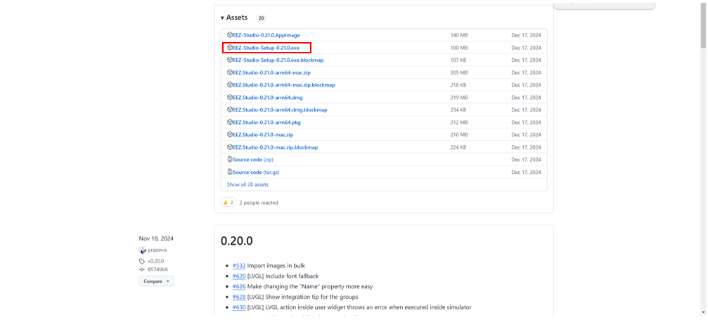

2. Double-click the downloaded installer and agree to the software license agreement to start installation.

### In the case of Linux PC (Ubuntu)

1. Get the EEZ Studio installer 'eezstudio_x.xx.x_amd64.deb' from the [GitHub page](https://github.com/eez-open/studio/releases).
If you cannot find the installer in the list, click 'Show all xx assets' at the bottom of the list to show all items.
  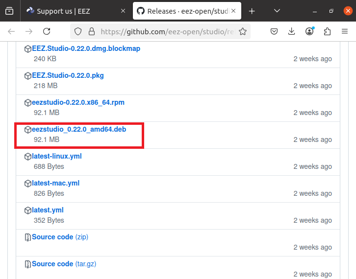

2. Double-click the downloaded installer and click the Install button.
  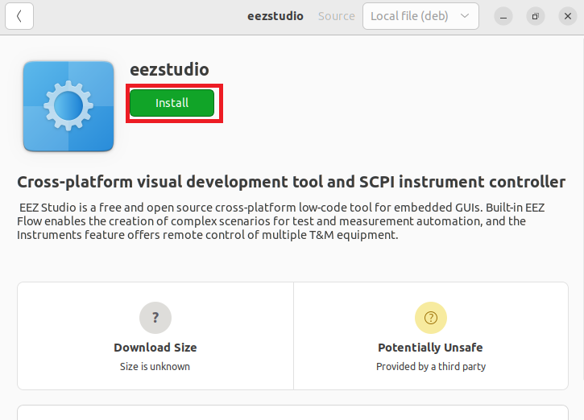

3. Enter the login password and click Authenticate to start the installation.
  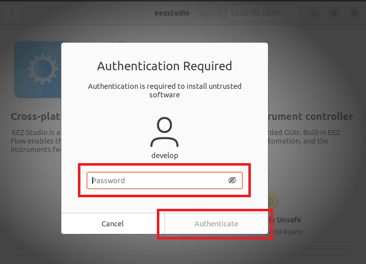

## Development of GUI

The development flow described in this guide is as follows.

1. Create GUI and generate source code in EEZ Studio on your PC.
2. Build the GUI application from the generated source code on your Linux PC.
3. Copy the built executable file into a microSD card and run it on the EVK.

### 1. Create GUI and Generate source code

You can create LVGL GUI applications using EEZ Studio on your PC.
And it supports generating source code.

#### Creating a project

1. Start EEZ Studio, select "File" on the left tab and choose "New Project".
  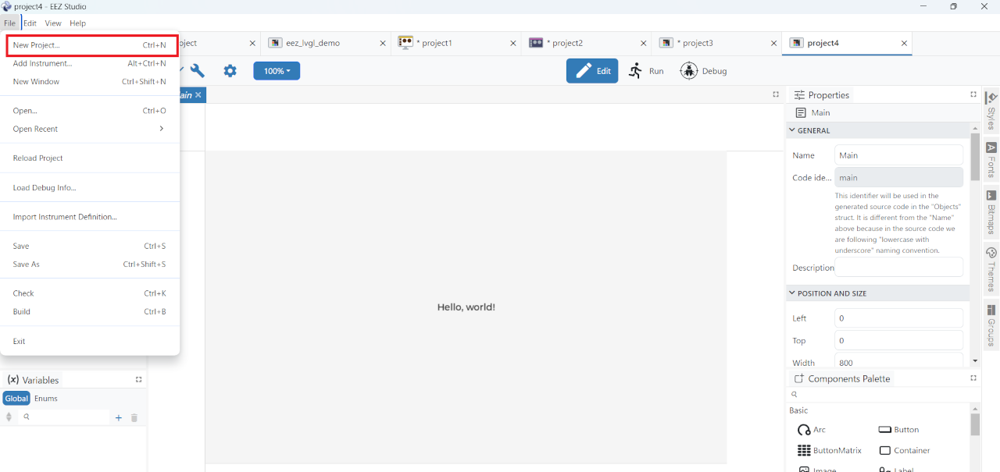

2. Select "LVGL" and enter an arbitrary project name in PROJECT SETTINGS and press Create Project.
  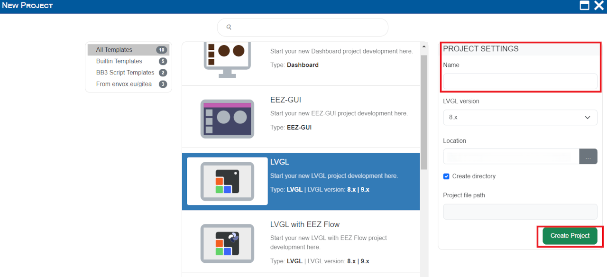

#### Creating GUI

1. Adding widgets
Drag and drop the necessary widgets (e.g. Arc) from the Components Palettes.
  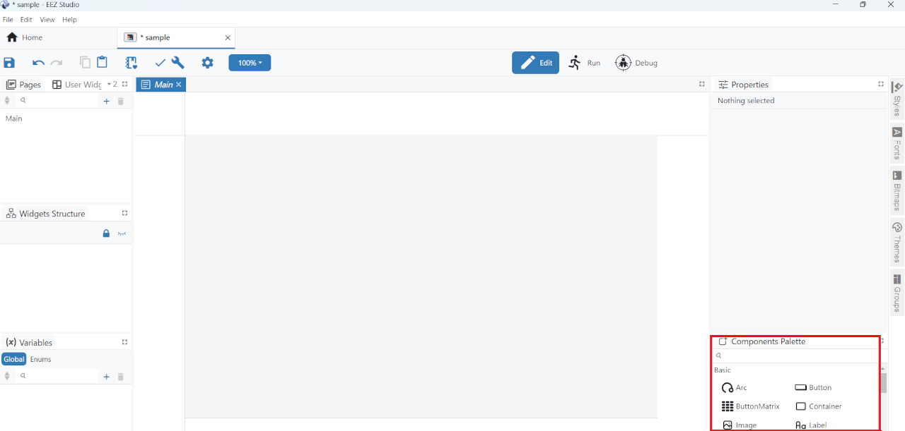
  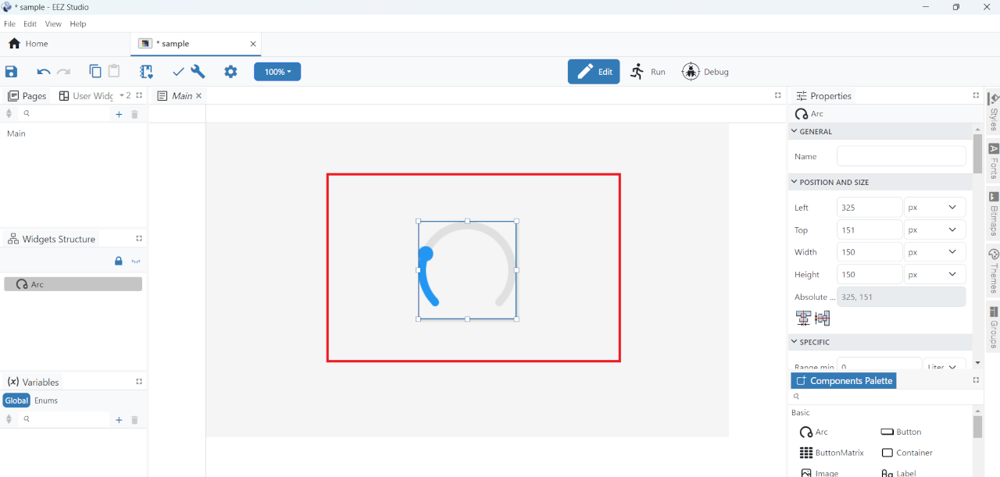

2. Change the size and display of widgets
You can resize the widgets (e.g. Arc) by expanding the blue frame.
  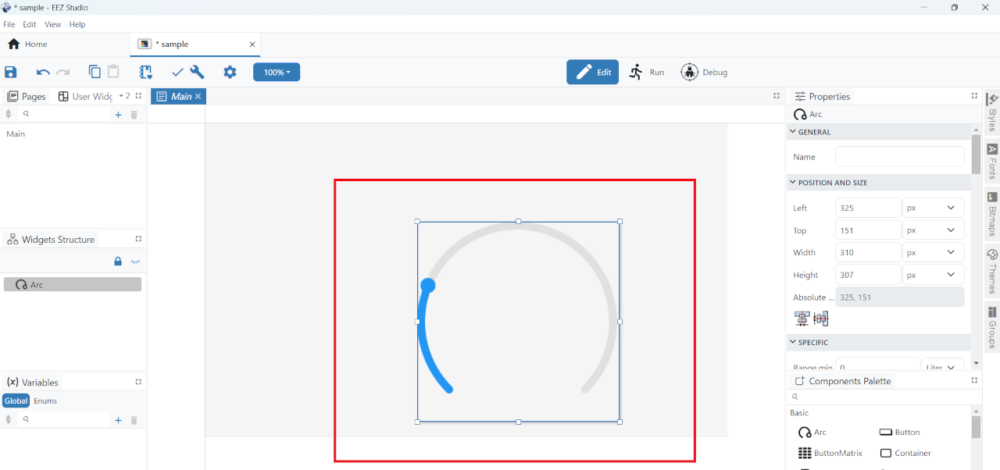
You can also change the size from POSITION AND SIZE in widgets (e.g. Arc).
  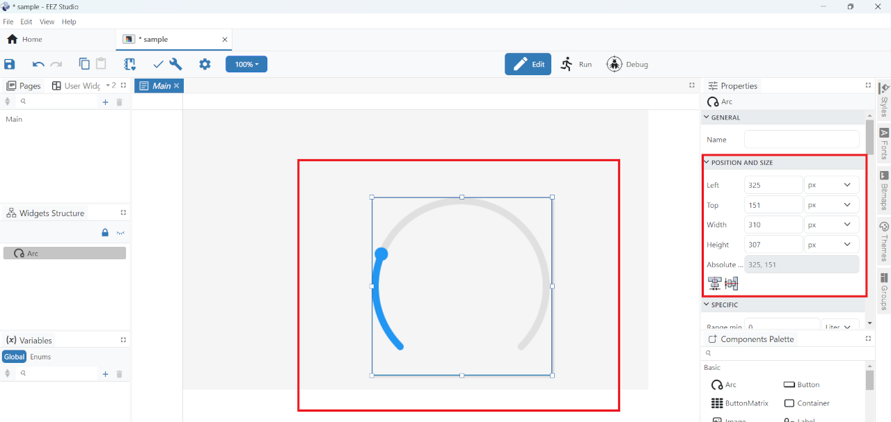
	- Left - Move widgets left and right.
	- Top - Move widgets up and down.
	- Width - Set the width of widgets.
	- Height - Set the height of widgets.
	<br>
SPECIFIC in WIDGETS (e.g. Arc) to change the way it is displayed.
SPECIFIC has different items that can be changed depending on the widgets displayed.
  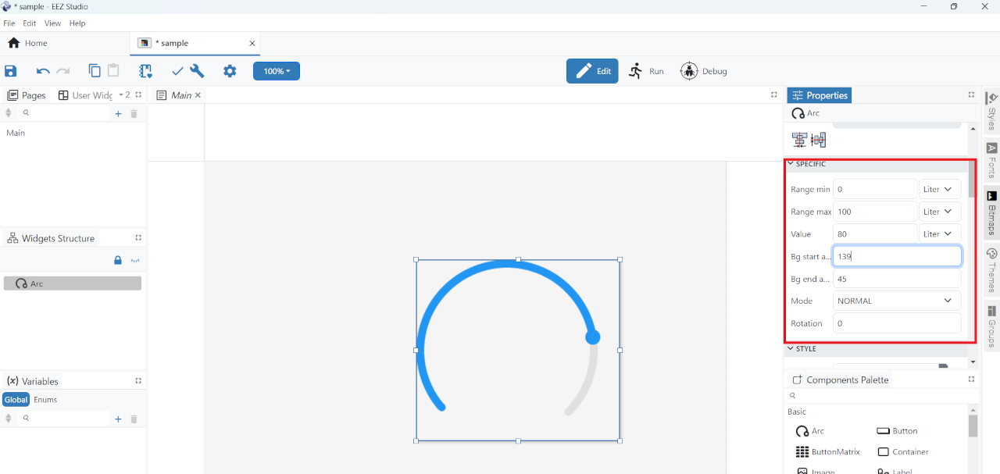
	- Range min - Minimum value of range
	- Range max - Maximum value of range
	- Value - Length of the blue line (depends on the application.)
	- Bg start angle - Starting point of the blue line
	- Bg end angle - End of the blue line
	- Mode - Select from three types.
	<br>
NORMAL appears at the fixed position of the blue line, SYMMETRICAL at the symmetrical position of the fixed position of the blue line, and REVERSE at the exact opposite position of the fixed position of the blue line.

3. Adding image files
Click on bitmaps on the right and drag and drop image files from Explorer into the red box.
  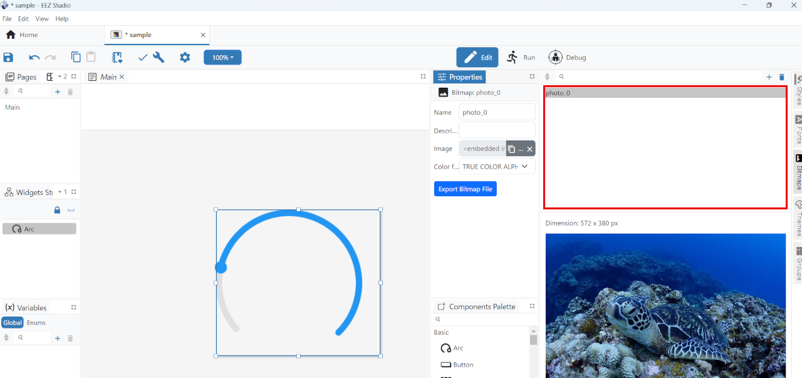

4. Apply image to widgets (image).
Drag and drop the necessary widgets (image) from the Components Palettes.
  
  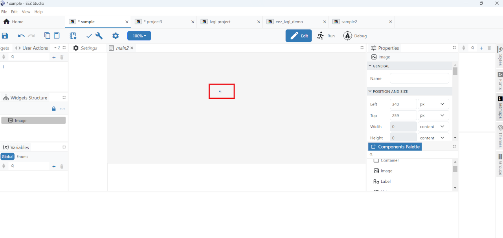
Add the image files added in Add Image Files.
  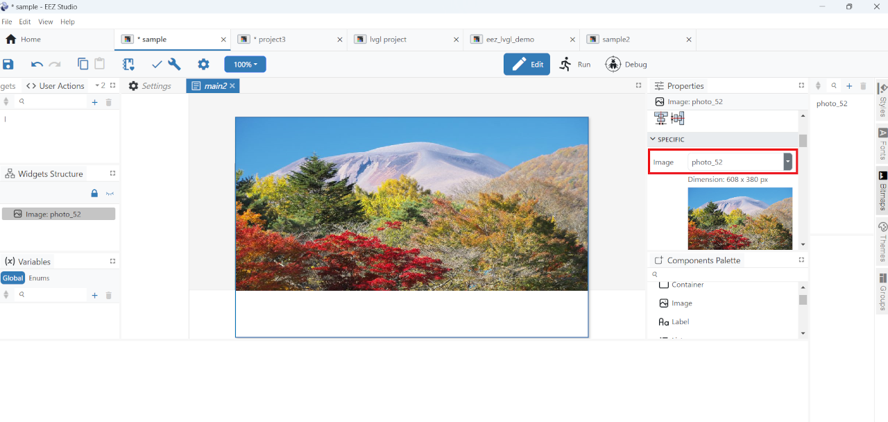

5. Apply image to widgets (imagebutton).
Drag and drop the necessary widgets (imagebutton) from the Components Palettes.
  
  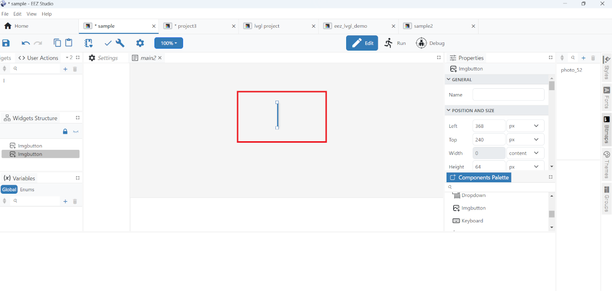
Add the image files added in Add Image Files.
  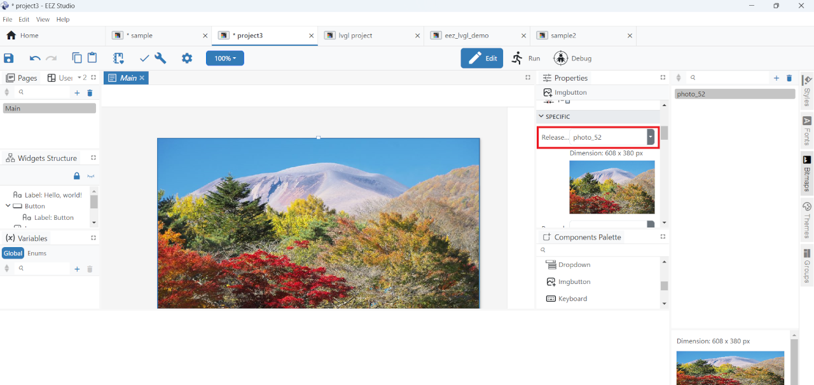

#### Generating C source code

1. Open the created UI project in EEZ Studio
  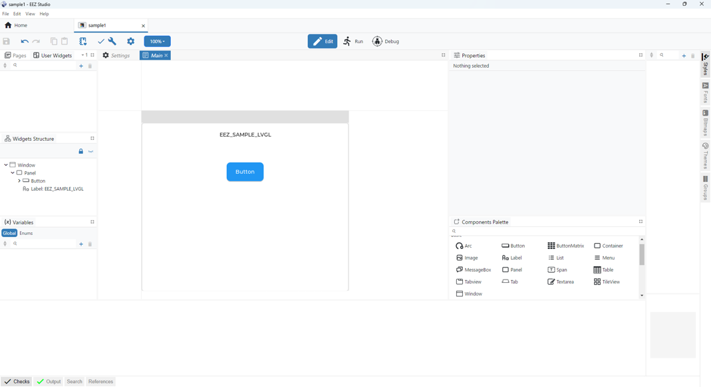

2. Generate source code by following the steps below.

	- 2.1. Preservation

	- 2.2. Check the settings.

	- 2.3. Build and generate source code
	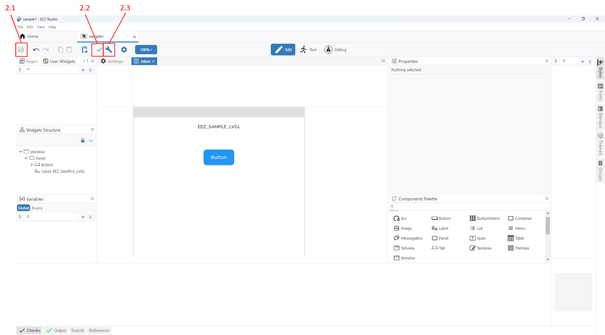

3. Source code is generated.
Source files are generated in the source folder in the project within eez-project.
  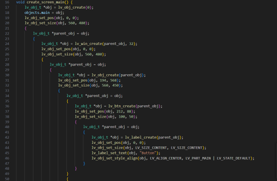

#### Implementation of events

1. Follow the steps below to set up events using the UI in EEZ Studio.

	1. Press "+" for "event handlers" in the properties of the object for which you want to set events.
	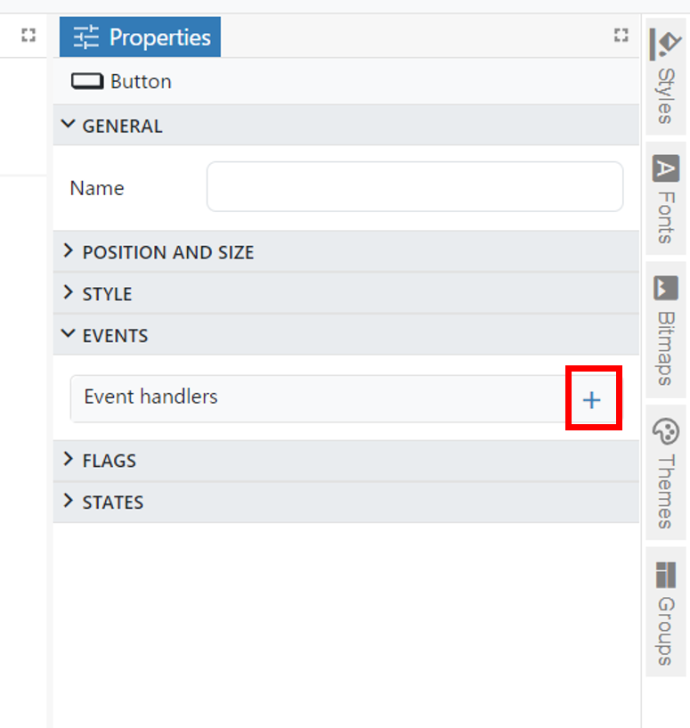

	2. Select "New Action" and set the event name.
	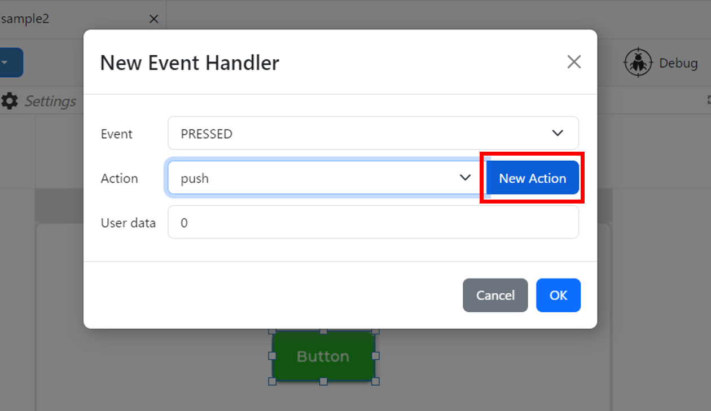

	3. Go to "User Actions", select the event created in the previous step, and copy the generated event callback template to screen.c.
	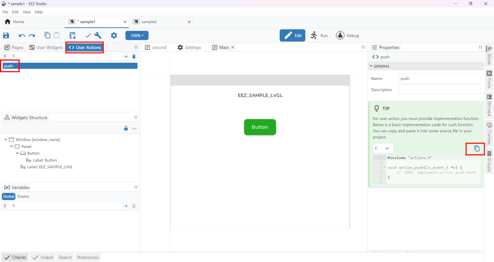

2. Implement the generated event callback in C language.
In this example, color of the button is changed in the event callback function.

```
void action_push(lv_event_t *e) {
	lv_obj_t btn = lv_event_get_target(e);

	lv_obj_set_style_bg_color(btn, lv_color_hex(0xfff6e01d), LV_PART_MAIN | LV_STATE_DEFAULT);
}
```

#### Implementation of screen transitions

- For screen transitions, a screen ID is assigned to each page in screen.h when a multi-page UI is created in EEZ Studio.
```bash title="screen.h"
enum ScreensEnum {
	SCREEN_ID_MAIN = 1,
	SCREEN_ID_SECOND = 2,
};
```

- To perform screen transitions, implement them in the event callbacks by yourself using the C language.
In this example, screen transition is implemented in an event callback is.
```
void action_push(lv_event_t *e) {
	loadScreen(SCREEN_ID_SECOND);
}
```

### 2. Build LVGL GUI applications

You can build LVGL GUI applications from the generated source code.
Please note that you need to build the applications on a Linux PC.

#### Setting up cross compiler

Install cross compiler to your Linux PC, and enable the compiler.
To install and enable the compiler, see [Step 6: Build sample application](../../getting_started/#step-6-build-sample-application).

#### Building GUI application

1. Add "main.c" to the generated “src/ui folder.
An example of main.c is shown in [Appendix](#Appendix).

2. Create a Makefile in the generated "src/ui folder" and execute make command.
An example of MakeFile is shown in [Appendix](#Appendix).

### 3. Deploy and run LVGL GUI applications

Copy the built executable file into a microSD card so that you can run it on the EVK.

#### Checking operation of the application on EVK

1. Copy the generated executable file to the root filesystem in an SD card.
For information about how to copy the file, see [Step 7: Deploy sample application](../..//getting_started/#step-7-deploy-sample-application).

2. Set execute permission on the file.
```bash
chmod +x <executable file name>
```
{: .hash }

3. Execute the file.
```bash
./<executable file name>
```
{: .hash }

  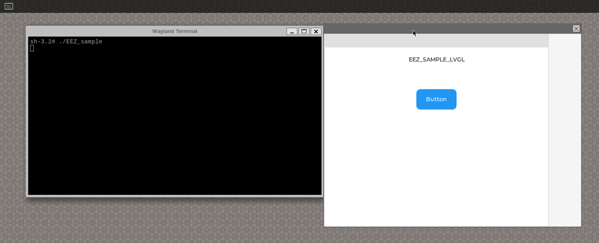

## Appendix

### Sample source code

```bash title="main.c"
#include   <unistd.h>
#include   <time.h>
#include   <sys/time.h>
#include   <fcntl.h>
#include   <stdlib.h>
#include   <string.h>
#include   <stdio.h>
#include   <stdlib.h>
#include   <limits.h>
#include   <errno.h>
#include   <poll.h>
#include   <stdbool.h>
#include   <getopt.h>

#include   "lvgl/lvgl.h"
#include   "lvgl/lv_drivers/lv_drv_conf.h"

/* Added to run EEZ Studio generated source code */ 
#include "ui.h"
      
#if    USE_FBDEV && USE_EVDEV
  #undef   RUNS_ON_WAYLAND
#elif  USE_WAYLAND
  #define  RUNS_ON_WAYLAND
#else
  #error   LVGL drivers configuration error.
#endif

#ifdef RUNS_ON_WAYLAND
  #include "lvgl/lv_drivers/wayland/wayland.h"
#else
#include   "lvgl/lv_drivers/display/fbdev.h"
#include   "lvgl/lv_drivers/indev/evdev.h"

typedef struct {
    lv_coord_t width;
    lv_coord_t height;
    bool end;
    lv_color_t *buff;
    lv_disp_draw_buf_t draw_buf;
    lv_disp_drv_t drv;
    lv_disp_t *disp;
    lv_indev_drv_t indev_drv;
    lv_indev_t *mouse_indev;
} dispinf_fbevdev_t;
#endif /* RUNS_ON_WAYLAND */

#define MAX_JSON_ARR 8
#define WINDOW_WIDTH 640
#define WINDOW_HEIGHT 480

#ifndef RUNS_ON_WAYLAND

/* Create fbdev window with evdev */
static dispinf_fbevdev_t *create_fbdev_window()
{
    uint32_t width, height;
    dispinf_fbevdev_t *dispinf;
    lv_disp_drv_t *disp_drv;
    lv_obj_t *cursor_obj;
    bool ret;

    /* Init Linux frame buffer device for LVGL */
    fbdev_init();
    fbdev_get_sizes(&width, &height, NULL);

    dispinf = lv_mem_alloc(sizeof (dispinf_fbevdev_t));
    if (!dispinf) {
        printf("ERROR!! memory allocation failed at lv_mem_alloc()\n");
        return NULL;
    }

    dispinf->buff = lv_mem_alloc(width * height * sizeof(lv_color_t));
    if (!dispinf->buff) {
        printf("ERROR!! memory allocation failed at lv_mem_alloc()\n");
        lv_mem_free(dispinf);
        return NULL;
    }
    lv_disp_draw_buf_init(&dispinf->draw_buf, dispinf->buff, NULL,
                            width * height);

    disp_drv = &dispinf->drv;
    /* Initialize and register a display driver */
    lv_disp_drv_init(disp_drv);

    disp_drv->draw_buf     = &dispinf->draw_buf;
    disp_drv->flush_cb     = fbdev_flush;
    disp_drv->hor_res      = (lv_coord_t)width;
    disp_drv->ver_res      = (lv_coord_t)height;
    disp_drv->physical_hor_res = (lv_coord_t)width;
    disp_drv->physical_ver_res = (lv_coord_t)height;

    dispinf->disp = lv_disp_drv_register(disp_drv);

    dispinf->width = (lv_coord_t)width;
    dispinf->height = (lv_coord_t)height;

    /* Init evdev for LVGL */
    evdev_init();

    lv_indev_drv_init(&dispinf->indev_drv);

    dispinf->indev_drv.type = LV_INDEV_TYPE_POINTER;
    /* This function will be called periodically (by the library)
       to get the mouse position and state */
    dispinf->indev_drv.read_cb = evdev_read;

    dispinf->mouse_indev = lv_indev_drv_register(&dispinf->indev_drv);

    /* Set a cursor for the mouse */
    LV_IMG_DECLARE(mouse_cursor);
    /* Create an image object for the cursor */
    cursor_obj = lv_img_create(lv_scr_act());
    lv_img_set_src(cursor_obj, &mouse_cursor);
    /* Connect the image  object to the driver */
    lv_indev_set_cursor(dispinf->mouse_indev, cursor_obj);

    return dispinf;
}
      
static void close_fbdev_window(dispinf_fbevdev_t *dispinf)
{
    if (!dispinf) {
        printf("ERROR!! no object to be freed.\n");
        return;
    }

    if (dispinf->mouse_indev)
        lv_indev_delete(dispinf->mouse_indev);

    if (dispinf->disp)
        lv_disp_remove(dispinf->disp);

    if (dispinf->buff)
        lv_mem_free(dispinf->buff);

    lv_mem_free(dispinf);

    fbdev_exit();
}
#endif

int main(int argc, char *argv[])
{
#ifdef RUNS_ON_WAYLAND
    struct pollfd pfd;
    uint32_t time_till_next;
    int sleep;
    lv_disp_t *disp;
#else /* FBDEV and EVDEV  */
    dispinf_fbevdev_t *disp;
#endif    
    int32_t window_width = WINDOW_WIDTH;
    int32_t window_height = WINDOW_HEIGHT;
    int32_t ret = 0;

    int btn_cnt = 0;


    /*LVGL init*/
    lv_init();

#ifdef RUNS_ON_WAYLAND
    lv_wayland_init();

    disp = lv_wayland_create_window(window_width,window_height,
                            "Window Demo", NULL);
    if (disp == NULL) {
        printf("ERROR!! lv_wayland_create_window\n");
        goto APP_EXIT;
    }

    pfd.fd = lv_wayland_get_fd();
    pfd.events = POLLIN;

#else /* FBDEV and EVDEV  */
    disp = create_fbdev_window();
    if (disp == NULL) {
        printf("ERROR!! lv_wayland_create_window\n");
        goto APP_EXIT;
    }
    /* Clear end flag */
    disp->end = false;
    window_width = disp->width;
    window_height = disp->height;
#endif
    
    /* make_screen */
    /*Added to run EEZ Studio generated source code */
    ui_init();

    while(1) {
#ifdef RUNS_ON_WAYLAND    
        /* Handle any Wayland/LVGL timers/events */
        time_till_next = lv_wayland_timer_handler();

        /* Run until the last window closes */
        if (!lv_wayland_window_is_open(NULL)) {
            break;
        }

        /* Wait for something interesting to happen */
        if (time_till_next == LV_NO_TIMER_READY) {
            sleep = -1;
        } else if (time_till_next > INT_MAX) {
            sleep = INT_MAX;
        } else {
            sleep = time_till_next;
        }
        while ((poll(&pfd, 1, sleep) < 0) && (errno == EINTR));
#else /* FBDEV and EVDEV  */
        lv_timer_handler();
        usleep(5000);
        if (disp->end)
            break;
#endif
    }

APP_EXIT:

#ifdef RUNS_ON_WAYLAND
    lv_wayland_deinit();

#else /* FBDEV and EVDEV  */
    close_fbdev_window(disp);
#endif
    return 0;
}
/**
 * Set in lv_conf.h as `LV_TICK_CUSTOM_SYS_TIME_EXPR`
 */
uint32_t custom_tick_get(void)
{
    static uint64_t start_ms = 0;
    struct timeval tv_start;
    struct timeval tv_now;
    uint64_t now_ms;

    if(start_ms == 0) {
        gettimeofday(&tv_start, NULL);
        start_ms = (tv_start.tv_sec * 1000000 + tv_start.tv_usec) / 1000;
    }
    gettimeofday(&tv_now, NULL);
    now_ms = (tv_now.tv_sec * 1000000 + tv_now.tv_usec) / 1000;

    return (uint32_t)(now_ms - start_ms);
}
```

```bash title="Makefile"
BIN = EEZ_sample
CFLAGS += -I${SDKTARGETSYSROOT}/usr/include/lvgl  -I${SDKTARGETSYSROOT}/usr/include/lvgl/lv_drivers -DLV_CONF_INCLUDE_SIMPLE
LDFLAGS += -llvgl -llv_drivers -lwayland-client -ltoml
SRC_DIR := ./ui
MAIN := $(SRC_DIR)/main.c
SRCS := $(shell find $(SRC_DIR) -name '*.c' ! -name 'main.c')
MAINOBJ = $(MAIN:.c=.o)
OBJS := $(SRCS:$(SRC_DIR)/%.c=$(SRC_DIR)/%.o)
.PHONY: all clean
all: default
%.o: %.c
    @$(CC)  $(CFLAGS) -c $< -o $@
default: $(OBJS) $(MAINOBJ)
    $(CC) -o $(BIN) $(MAINOBJ) $(OBJS) $(LDFLAGS)
clean:
    @echo "Cleaning ... "
    rm -f $(BIN) $(MAINOBJ) $(OBJS)
```

